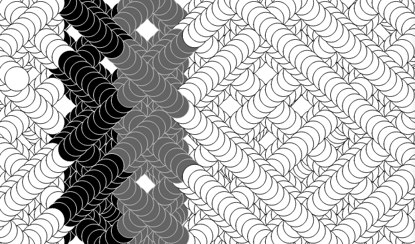
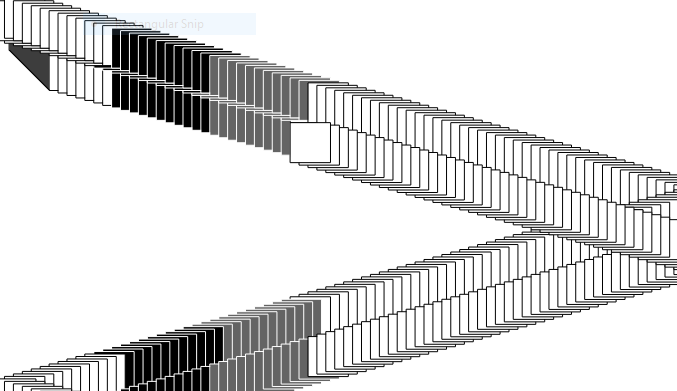
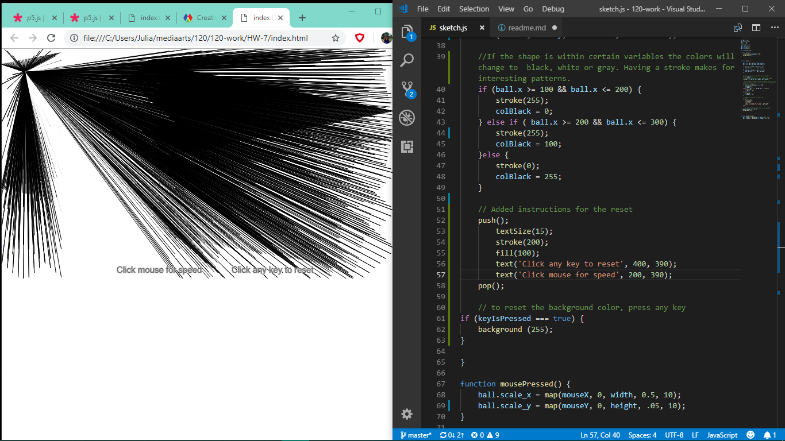

Julia Ballas, 50

[Live Sketch Week 7: Searchlight](https://jballas.github.io/120-work/HW-7/index.html)


# HW 7 | Describe then Alter the Bouncing Ball

## Description of What the Original Code is Doing

<!--
--This is a Comment Block--

Please describe what the original code is doing.

Why is it working the way it is?
What does each line do?
How can you make the ball change direction?

-->
The original code has a simple premise. You see an ellipse moving across the screen at an angle, but when you click on your mouse you can change how it moves. This depends on where you mouse is on the screen.

Here is the code that creates the inital movement:

```JS
ball.x += ball.delta_x * ball.scale_x; // creates the angular movement of ball.x variable
ball.y += ball.delta_y * ball.scale_y; // create the angular movement of ball.y variable
```

  The first `if()` statement keeps the ball.x within the width of the canvas by using a greater than less than symbol. The second `if()` statement does the same thing, but with the y coordinate and keeps the ball within the height of the canvas.

```JS
    if (ball.x >= width || ball.x <= 0) {
        ball.delta_x = -1 * ball.delta_x; //multiplying by -1 to keep ball within width of canvas
    }
    if (ball.y >= height || ball.y <= 0) {
        ball.delta_y = -1 * ball.delta_y; //multiplying by -1 to keep ball within height of canvas
    }
```

Where the code really gets interesting is with the `mousePressed()` function, which effects the ball.scale_x and ball.scale_y variables.

 The variables are assigned new values using the `map()` function. It takes the value of `mouseX` and changes the output range from 0 to the width of canvas, and reduces that to a range of 0.5 to 10.

```JS
function mousePressed() {
    ball.scale_x = map(mouseX, 0, width, 0.5, 10);
    ball.scale_y = map(mouseY, 0, height, 0.5, 10);
}
```

What does this code do? It effects the speed of your ball.

If you click your mouse of the top upper left, where it is closest to 0,0, then the 'speed' of the ball slows considerable. However, click toward the bottom right corner and the speed increases.

## How did you alter the sketch?

<!--
Please describe how and why you changed the sketch?
-->

I ended up changing three different parts of the sketch. In this order:

1. added grayscale color
2. new shape
3. a reset option with `keyIsPressed()`

### Adding a grayscale



By adding an `if()` statement below the ellipse, I changed the color of the ball within a certain range.

```JS
    if (ball.x >= 100 && ball.x <= 200) {
        stroke(255);
        colBlack = 0;
    } else if ( ball.x >= 200 && ball.x <= 300) {
        stroke(200);
        colBlack = 100;
    }else {
        stroke(0);
        colBlack = 255;
    }
 ```

### Shape

At first I tried changing the shape to a square, instead of an ellipse. This reminded me of a card game, but it wasn't different enough from the orignal code.



Then I changed the shape to a line, since that also only requires four parameters, and I was surprised at the difference. You can control the length of the line by where you click, and it sweeps back and forth like a spotlight or searchlight.



### Reset

Because the line tends to blend too much, and the black overlaps, I wanted to have a reset option. If you've made the line sweep faster, by clicking toward the right side of the screen, then it continues with this speed even after you click reset.

I added text to make this option clear to anyone viewing the sketch.

## Frustrations this week

I found working with someone else code very difficult. There was a limit to what I could adjust. It was already using mouseX, so I could **not** effectively use that in my alterations. So, I tried adding another shape.

### I experimented with adding a `rect()` to make a Pong-Copy

I added a new rectangle that was attached to mouseX and moved side to side. I used a variable called `block.x` and `block.y` I wanted to make the ball bounce off my rectangle, like a pong game, and it almost worked. I added the following `if()` statement:

```JS
   if (ball.x >= block.y) {
        ball.delta_y = -1 * ball.delta_y;
    }
```

But I ultimately I abandoned this idea. It was too complicated to make it a game, and sometimes the ball got stuck on screen or actually disappeared off screen. I could not fathom how to keep the ball bouncing around and bounce off my block.

## Conclusions

The boolean logic only works if you really have a grasp on what you're trying to make happen. I finally managed that with my color variation. Other attempts at logic slipped through my grasp.

Although, a few weeks ago I was frustrated by what I didn't know, now it feels like I have the opposite problem. There are so many options for animating and changing shapes I don't know which one is best, or which one to try first to solve my problem, or if that particular function is the one I need. The only way past this will be to keep experimenting with the code, and trying to actualize my ideas.