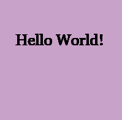
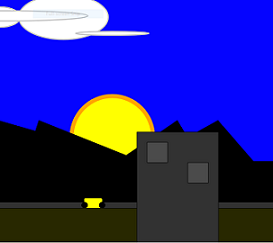
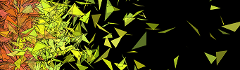
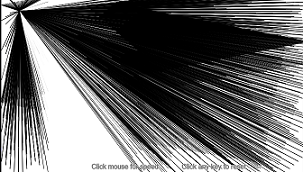
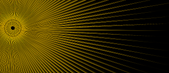
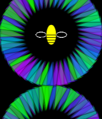
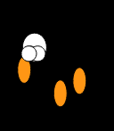
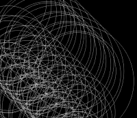

# 120-work

This is Julia Ballas's repo for Creative Coding 120 coursework.

## Projects

 [Hello World!](https://jballas.github.io/120-work/hw-3/)
Classic first program, static sketch

 [Julia's Portrait](https://jballas.github.io/120-work/hw-4/index.html)
static sketch with code

 [Timelapse Sketch](https://jballas.github.io/120-work/hw-5/index.html)
animated and interactive sketch

 [Pinwheels](https://jballas.github.io/120-work/hw-6/index.html)
animated sketch

 [Searchlight](https://jballas.github.io/120-work/HW-7/index.html)
Interactive sketch

 [Sunbursts](https://jballas.github.io/120-work/hw-8/index.html)
Interactive sketch

 [Flowers](https://jballas.github.io/120-work/hw-10/index.html)
Interactive sketch

 [Popcorn](https://jballas.github.io/120-work/hw-10/index.html)
Animated sketch

 [Butterflies](https://jballas.github.io/120-work/course-work/week-11-butterflies/index.html)
Animated sketch

 [Ripples](https://jballas.github.io/120-work/hw-10/index.html)
Animated sketch

Final Project