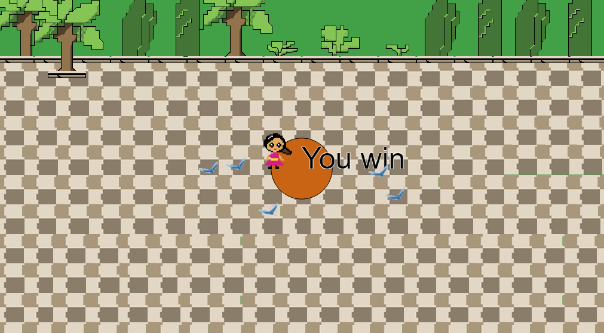
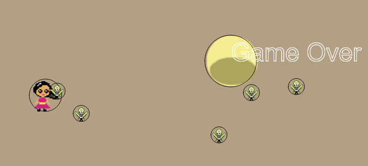

Julia Ballas 50

[link]https:

# Final Project

date

## Overview

Presenting my final project: Lucy and the Ghost of Garnet

TODO: LOGO for GAME

## Projects

- player.js
- sketch.js
- 

## Workflow / Deadlines

1. Coding (Finish by November 27th)
    - **Player movement (using `keyIsDown`)**
    - **Player interacts with goal**
    - **Enemy movement toward stationary target**
    - **Enemy movement toward moving target**
    - **Enemy interacts with Player**
    - **Random appearance on screen**
    - Obstacles
2. Sprites/ Concept Art (Finish by November 30th)
    - Lillia and Fairies
        - **PS pixel line art**
        - **PS coloring**
        - **Sprite animation/Sprite sheet**
    - Background sketch
        - **PS line art**
        - **PS coloring**
    - Main Page
        - **brainstorm ideas/draft**
        - **Logo sketch**
        - **line art**
        - **coloring**
    - **Add final sprites to game**
    - **Add final background to game**
3. Main Page and About page (Finish by December 1st)
    - Draft main page layout
        - A simple p5.JS animation loop?
    - Write About page
    - Final sketch
    - Link Main Page to About and Game
4. Sound (finish by Decemer 4th)
    - **Search Hooksounds.com or Musopen.org offer for free background music**
    - **Add background music to Game**
    - Add music to Main Page
    - **Search Freesound.org for creative-commons Sound effects**
    - **Add sound effects to game**

5. Impliment other ideas?

6. Playtesting/Feedback (Send to people around December 5th)
    - From friends and family
    - GitHub forum

7. Submit Final Project **deadline Tuesday December 11th, 8:00AM**

## Progress Report

date: 11-21-18

**Summary:** After finishing up my proposal, I started working on first step: Coding. This included coding the player and making it move using `keyIsDown`, which is tied to each of the directional arrow keys. Right now I have the speed moving at 5, but this is quite fast. I may consider revising it.

Secondly, I worked on the 'Player interacts with Goal'. I finally feel like I have a grasp on everything we learned in Week 12. I have a seperate file for the player, and it interacts with another class known as Goal.

Next up is Enemy movement. I'm going to make a Enemy Class for my ghost. Possibly ghosts. But I will start with one ghost. I'd love to be able to have more than one, and they could appear randomly or two at once, for higher difficulty. But one thing at a time.

Later today I'm going to work on sketching and pixel art in Photoshop.

I reviewed a p5.js pacman game to see how the code for a game was laid out, and specifcially how the objects interact(1), and our week 12 lesson for interaction between objects(2).

date: 11-23-18

**Summary:** I focused on making the enemy movement today. I want it to target the player, and I modified code from Dan Shiffman's Steering Behaviors. In his tutorial he discusses how the steering behavior, in this case a `seek()` function is defined by the simple equation of steering = desired velocity - current velocity (3). I used this in my Enemy.js file and now the object zips across the screen toward a stationary x,y position. Now the trick will be to get it to target a constantly moving position. I think I just need to put the current X,Y posistions into an array and then have the enemy target those numbers.

And I just discovered another problem. My goal function is not working. Somehow I deactivated that code so it doesn't recognize when the player reaches the goal.

Todo:

1. Add colors to objects, so I can identify them better.
2. Research code that targets a location that is constantly updating. Check the p5.js book as well as Dr. Musick's pacman and bubbles array for this behavior.

date: 11-26-18

**Summary:** Coding the enemy movement turned out to be the biggest struggle so far. I managed to make the enemy target a stationary point, but I could not figure out how to make it target a moving object. I knew it had to be possible. As I researched into this I discovered various methods to target the mouseX, and mouseY, but I was determined to keep my movement tied to the keyIsPress. After researching more about steering, I discovered another example in Dan Shiffman's Nature of Coding that used steering to target specific dots on a screen. (4) That's when I finally had a breakthrough. The enemy is programmed to `seek(target)` using the variable `let target = creatVector( player.pos.x,  player.pos.y)`. That's all it took.

The screenshot below shows a winning screen, with the player(white) touching the goal(gray), after avoiding the enemy(red).


Here is the `draw()` function of my game:

```JS
function draw() {
    background(0);

    let target = createVector( player.pos.x, player.pos.y); // This creates the vector target that the enemy will seek. I didn't need an array to hold the pos.x,pos.x. I needed a vector.

    goal.displayPortal();

    player.display(); // Displays the player on screen
    player.move(); // Allows the user to control the player with keyboard arrows
    player.inBounds(); // Keeps the player inside the walls of the screen.

    reachedGoal();

    enemy.display(); // Displays the enemy on screen
    enemy.seek(target); // This uses the enemy's steering to seek out the target
    enemy.update(); // This controls how the enemy moves: the velocity and acceleration

    gameOver();

}
```

Next, I need to focus on concept art, and getting sprite animation. I'm looking forward to this part.

date 12-3-18

**Summary**: Over the weekend I worked on my artwork, and I found pixel art as frustrating at the game. I was pretty satified with the tropical setting, until I added the sprites on top of it and did some play testing, now I hate the background. I'm going to make it simplier. The pattern I made at first is too jarring.


Other Image issues I need to address:

- Background should be simply black or a light brown color with some of the trees at top.
- Impilmenting my portal is not working at the moment. So I'm just using a p5.js circle as by portal.
- I also I realized my fairy's wing is cut off on the left, so I need to adjust the size again!

Other concerns: I'm also struggling with the 'hit boxes'. When I had the game as circles, I could definetely tell where the boundaries are, but with sprites I can't always tell. I wonder if I could layer a circle on top, to see the difference.

I'm going to have to post to the forum, or else find out when lab hours are this week, because I don't have any ideas how to fix this problem with 'hit boxes'.



My Todo List

- create a Main page and About page that will link to the main game. Using HTML? Or stick with p5.js?
- Start button
- restart button
- Obstacles?
- Can I add a text conversation game?

date: 12-4-18
**Summary:**
I researched dialogue trees and discovered a wonderful program called [Twine](http://twinery.org), which allows you to create HTML based interactive fiction. This is too much work to try and add a second conversation based game in p5.js, so I'm just going to focus on getting the game to work properly.

I fixed the backgrounds, and figured out how to make my 'hit boxes work. I added in the test circles. This allowed me to see where the characters were hitting each other.



My solution was to change the `imageMode()`. The default is CORNERS, which specifies that the 2nd and 3rd parameters are attached to the upper left corner. When I changed to `imageMode(CENTER);` then the images are more like ellipses. Success! It fixed my hit boxes. Of course, after that I had to adjust my boundaries to make sure my sprite stayed on screen properly.

My next problem is adding the main page, and start game button. I looked over the Pacman game again (1), and started poking around on our github Issues forum. @HagenNataniel has been working on a trivia game, and there was a link to another p5.js game, which uses a Game Start screen, as well as the main game Screen.

Looks like I'm going to have to impliment an if/else statement and a game start button.

I reviewed more of Dan Shiffman's DOM videos, to see how adding HTML elements works in p5.js. When I tried to add HTML information straight to my index file, I didn't like the layout anymore. I also had to download the newest version of dom.min.js library because of an error with the button.

Lasty, I am getting warning from google about my audio playing automatically.


TODO:

- Add if/else statement to get game screen
- Button to start the game, and then when it's game over, to restart the game
- Credits/About page, because I need to give attributions for my audio files. 

CONCERNS:

- How do I tell people what the best size for the game is?
- Im concerned about scalability. What if someone views this game on a phone? It wouldn't play. 
- How do I change the background images from static to something that will adjust automatically to screen size?

### Images and Sound


Using the `function preload()` I added in images for my fairies, and for Lillia, my main character. The trouble was getting used to drawing in the 8bit or pixel art style. I got some tips from youtube channel by blackthornprod. Each pixel has to do a lot of work, and typically 8bit games don't use very many colors. (5)

As for animating, the advice I recieved was to keep my animations simple, like the artwork. After some experimenting I ended up with a very basic movement for both characters. Lillia's arms move up and down, and the fairies' wings flap up and down. (6)

During my study of p5.js sound I watched more of Dan Shiffman's tutorials. In two different videos he gives some simple examples of adding background music, and adding sound effects to a game (7) (8). This was exactly what I needed. It was also very similar to preloading the image files. I feel like the beginning of my file has too many variables and preloaded images, but I'm trying to keep the file sizes down.


## Conclusion


## Sources

(1) [Kuiphoff, John. "Pacman Game using p5.js". coursescript.com/notes/interactivecomputing/game/](http://coursescript.com/notes/interactivecomputing/game/pacman/sketch.js).

(2) [Musick, Michael. "Week 12 Bouncing Balls".  montana-media-arts.github.io/creative-coding-1/modules/week-12/objects-w-each-other/](https://montana-media-arts.github.io/creative-coding-1/modules/week-12/objects-w-each-other/).

(3) [Shiffman, Dan. "Coding Challenge #59: Steering Behaviors." The Coding Train. February 2017. www.youtube.com/watch?v=4hA7G3gup-4](https://www.youtube.com/watch?v=4hA7G3gup-4)

(4)  [Shiffman, Dan. "Coding Challenge 61.1: Evolutionary Steering behaviors - Part 1." The Coding Train. April 2017. www.youtube.com/watch?v=flxOkx0yLrY](https://www.youtube.com/watch?v=flxOkx0yLrY)

(5) ["How to draw pixel art game characters in PS - Tutorial" YouTube. Blackthornprod. May 2018. www.youtube.com/watch?v=qzvYu48kw5Q](https://www.youtube.com/watch?v=qzvYu48kw5Q)

(6) ["How to animate Pixel art Game Characters in PS - Tutorial". YouTube blackthornprod. May 2018. www.youtube.com/watch?v=mnJb5iwYAmg](https://www.youtube.com/watch?v=mnJb5iwYAmg)

(7) [Shiffman, Dan. "17.1: Loading and Playing - p5.js Sound Tutorial" The Coding Train. June 2017. www.youtube.com/watch?v=Pn1g1wjxl_0](https://www.youtube.com/watch?v=Pn1g1wjxl_0)

(8) [Shiffman, Dan. "17.5: Adding Sound Effects - p5.js Sound Tutorial." The Coding Train. June 2017.www.youtube.com/watch?v=40Me1-yAtTc&t=864s](https://www.youtube.com/watch?v=40Me1-yAtTc&t=864s)