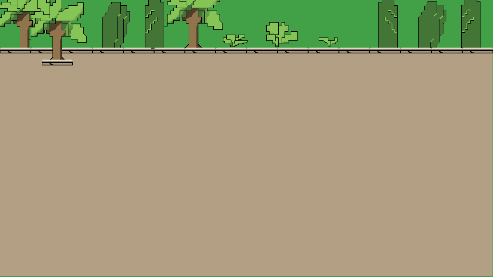

Julia Ballas 50

[link]https:

# Final Project

date 12-10-18

## Overview

My final project for Media Arts Creative Coding 1 at the University of Montana is a p5.js game called Fairy Doctor Runs Away.

The game is inspired by the fantasy series <em>Fairy Doctor Falls in Love</em> by Ava Clary. The story follows Lillia Brimclif, a young woman who is in trouble. She used to be a fairy doctor, but she quit. Unfortuantely, the fairies don't understand. They want her back and if they catch her, it's game over. Try to escape through portal before the fairies catch you!


## Projects

- enemy.js
- goal.js
- player.js
- sketch.js
- Sounds
- Images

## Workflow / Deadlines

1. Coding (Finish by November 27th)
    - Player movement (using `keyIsDown`)
    - Player interacts with goal
    - Enemy movement toward stationary target
    - Enemy movement toward moving target
    - Enemy interacts with Player
    - Random appearance on screen
2. Images / Sound (Finish by December 4th)
    - Lillia and Fairies
        - create pixel line art
        - color in Photoshop
        - Sprite animation/Sprite sheet
    - Background sketch
        - create pixel line art
        - color in Photoshop
    - Main Page
        - brainstorm ideas/draft
        - create Logo
        - draft line art
        - color in photostop
    - Add code for final sprites
    - Add code for background images
    - Sound
        - Search Hooksounds.com or Musopen.org offer for Creative Commons background music
        - Add code for background music
    - Add music to Main Page
        - Search Freesound.org for creative commons Sound effects
        - Add code for sound effects
3. Code Game Screens and About Page
    - Add a Start Button
    - P5.JS Dom elements for About page
    - Code different Game Screens 0, 1, 2 and connect using an if/else statment
4. Playtesting/Feedback (Send to people around December 5th)
    - Coding changes
        - Add left handed player controls WASD
        - Add a loading time. Display sprites, but don't let them move for X seconds
        - Add a button to restart game after winning
    - Add a Mute Button
    - Adjust volume of sounds
    - Change Main Page background, font style, add in controls and basic story.

5. Final proofreading and copy edits
    - Clean up Code
    - Finish Readme
    - Proofreading

6. Submit Final Project **deadline Tuesday December 11th, 8:00AM**

## Coding Phase 1

The first phase of coding my game began immediately after I finished my proposal. I wanted to focus on the game play, which includes the player movements and the enemy movements.

### Challenges in phase 1

- Player movement and interaction with a goal
- Enemy movement, specifically having the enemy target the player.

### Solutions in phase 1

I decided my player movement should use `keyIsDown`, which I tied to the arrow keys. The challenge was having player interacts with a goal. I studied a pacman-clone made in p5.js to see how the game was laid out, and specifcially how the objects interacted, and our week 12 lesson for interaction between objects(2). I finally felt like I understood everything we learned in Week 12.

Each object is a seperate class, and contained in a seperate file: 'player.js' and 'goal.js'. Lastly, I made a class for the enemy called 'enemy.js'.

Next up was Enemy movement.

I created a new class called Enemy, so I could have more than one enemy appear at a time, in random locations. For the enemy movement I studied and modified the code from Dan Shiffman's Steering Behaviors. In his tutorial he discusses how the steering behavior, in this case a `seek()` function is defined by the simple equation of steering = desired velocity - current velocity (3).

The enemy object zipped across the screen toward a stationary x,y position. Now the trick will be to get it to target a constantly moving position. I struggled with this, thinking I needed to make an array that continaed the player's x,y positions.

I knew it was possible, because I discovered various methods to target the mouseX, and mouseY, but I was determined to keep my movement tied to arrow keys with the `keyIsPress`. After researching more about steering, I discovered another example in Dan Shiffman's Nature of Coding that used steering to target specific dots on a screen. (4) That's when I finally had a breakthrough. The enemy is programmed to `seek(target)` using the variable `let target = creatVector( player.pos.x,  player.pos.y)`. That's all it took.

The screenshot below shows a winning screen: the player(white) touches the goal(gray), after avoiding the enemy(red).


Here is an early example of the code from `draw()` function of my game, which shows a variable `target`, as well as player and enemy funtions.

```JS
function draw() {
    background(0);

    let target = createVector( player.pos.x, player.pos.y); // This creates the vector target that the enemy will seek. I didn't need an array to hold the pos.x,pos.x. I needed a vector.

    goal.displayPortal();

    player.display(); // Displays the player on screen
    player.move(); // Allows the user to control the player with keyboard arrows
    player.inBounds(); // Keeps the player inside the walls of the screen.

    reachedGoal();

    enemy.display(); // Displays the enemy on screen
    enemy.seek(target); // This uses the enemy's steering to seek out the target
    enemy.update(); // This controls how the enemy moves: the velocity and acceleration

    gameOver();

}
```

## Coding Phase 2

### Challenges in phase 2

- Adding sprite animation
- Adding sound
- Fixing the 'hit boxes' when my sprites interact
- Different Game Screens
- Adding HTMl or DOM elements

### Solutions in phase 2


After completing the basic gameplay, I needed to start adding the artwork and sound. This involved a study of Week 13 lesson. I kept my animations very simple with only two sprites, so the math wasn't too difficult to divide the animation sheets. Adding in the sound involved a brief study of Dan Shiffman's sound tutorials.(5) The code was very similar to adding in images, you need to preload the sound files.

However, after adding in the sprites I noticed the interaction between the player objects had been distrupted. I began to think of this as a problem with the 'hitboxes'. Sometimes, as I playtested the sprite would be much higher than the goal when I won, or the enemies would not actually hit me but a gameover would occur.

To fix this, first I added in the test circles around the sprites. This allowed me to see when the sprites were hitting each other.


The solution turned out to be simply changing the `imageMode()`. The default in p5js is CORNERS, which specifies that the 2nd and 3rd parameters are attached to the upper left corner. When I changed to `imageMode(CENTER);` then the images were more like ellipses. Success! It fixed my hit boxes. Of course, after that I had to adjust the boundaries of my make sure my sprite stayed on screen properly.

My next problem was how to add a main page, and create a start game button. I looked over the Pacman game again and started poking around on our github issues forum. @HagenNataniel has been working on a trivia game, and there was a link to another p5.js game, called Flappy Pong.(9)

I decided to impliment an if/else if/else if statement to switch between three 'pages'. Basically, if the Game Screen = 0 then my start screen will display. When Game screen = 1, then my game plays. If a game over occurs, then it goes straight back to the start screen. If the player wins, then game screen = 2 and the credits display.

There was some unexpected results. At one point the fairy enemies kept multiplying over and over every time I lost the game. There were way too many.


Luckily, there was an easy solution, I just had to make sure my enemy array was empty again whenever I restarted the game.

```JS
    else if( startingGame == 0){

        startScreenDisplay();
        fairies = []; // When I added this code, the fairies stopped spawning.
    }
```

For the game start button. I reviewed more of Dan Shiffman's DOM videos to see how adding HTML elements works in p5.js. When I tried to add HTML information straight to my index file, I didn't like the layout anymore. I also had to download the newest version of dom.min.js library because of an error with the button.

Here is the simple credits/about page I designed.


At this point in development I had done everything I could. Now, I needed some feedback. Of course, that's when I ran straight into an error. Although I was able to view my page on my computer, I could not view it on the github webpage. There was a sound loading error.


I have no clue why. Googling didn't reveal any solutions. I posted to the forum to see if anyone else knew a solution. At least, the game still works on my local server, but not on github. Not in Chrome or Firefox.

The next morning I fixed the error by moving my sound files into my direct folder, instead of having a seperate 'Sounds' file.

## Coding Phase 3

- Coding changes
  - Add left handed player controls WASD
  - Add a loading time. Display sprites, but don't let them move for X seconds
  - Add a button to restart game after winning
- Add a Mute Button
- Adjust volume of sounds
- Change Main Page background, font style, add in controls and basic story.

### Challenges in phase 3

It was very important to me to get feedback on my game. I'd designed and played the game myself so many times I coudn't see any flaws and what wasn't working. When I set up deadlines for this project I made sure to give myself time to impliment any changes. Both my sisters complained about the sound levels, so I made the volume level a variable I could change. `let volume = 0.25;`. I also added a mute button. The mute button appears only after you start the game, and effects both the sound effects and the background music.

My sister also described the as moving very fast, and it took my Dad 30-50 times to finally escape. I needed to make some changes.

### Solutions in phase 3

First, I decided to tackling the 'loading'. p5.JS loaded my animation immediately, but its very difficult to get oriented in the game that quickly.

I decided to add a loading time to the game sprites. After some research, and more help from Dan Shiffman, I discoverd the `setTimeout()` function in JS (10). I could use this to have my sprites display, and then a few seconds later they start moving. This was so frustrating. I couldn't figure out where to put `setTieout()`. Should it go inside my Class funtions? Or inside the main file? Eventually, I got it to work inside the main sketch file, when I display the enemy and player. I also needed to make more functions to call inside the `setTimeout()`.

Here is the new function I created:

```JS
/********* Loading Timer Functions *********/

function loadingPlayer(){
    player[0].frame();
}

function loadingEnemies(target, fairies, i){
    fairies[i].frame(target);
    fairies[i].avoidOthers(fairies, i);
}
```
I had trouble because some of my enemy functions also had parameters.
I googled a solution on this and thankfully discovered where to put my parameters. (11)

```JS
setTimeout(yourFunctionReference, 4000, param1, param2, paramN);
```

This, fixed my loading. Now, when you start the game there is a brief 'loading' before the fairies move. I can also adjust how long this loading lasts with a variable called. `let loadingTime = 500;`.

I also discovered an interesting glitch. If you continue to hit the start button it spawns more and more fairies. Ah, ha! This is hard mode!

### Images and Sound


The story for Fairy Doctor is set in Sinapore, so the game needed a tropical setting.

I wanted bright colors for my fairies and the main character, Lillia. Drawing in the 8bit or pixel art style is very different from my usual sketching. I got some tips from a youtube channel by blackthornprod. Each pixel has to do a lot of work, and typically 8bit games don't use very many colors (5).

I ran into a challenge with the background. At first the pattern I made was too jarring.


Eventually, I changed from a pattern to a solid brown color.



As for animating, the advice I recieved was to keep my animations simple, like the artwork. After some experimenting I ended up with a very basic movement for both characters. Lillia's arms move up and down, and the fairies' wings flap up and down (6).

During my study of p5.js sound I watched more of Dan Shiffman's tutorials. In two different videos he gives some simple examples of adding background music, and adding sound effects to a game (7) (8). This was exactly what I needed. It was also very similar to preloading the image files. I feel like the beginning of my file has too many variables and preloaded images, but I'm trying to keep the file sizes down.

.....................
Lasty, I am getting warning from google about my audio playing automatically.


## Reject Ideas

I researched dialogue trees and discovered a wonderful program called [Twine](http://twinery.org), which allows you to create HTML based interactive fiction. This is too much work to try and add a second conversation based game in p5.js, so I'm just going to focus on getting the game to work properly.

## Forum Issues

I've been helping people debug their code project. @JoleneTiffanyG had some small typos in her code I found. @HagenNathaniel couldn't get his code to display and I suggested he download the newest version of dom.min.js file, because of a button error.


## Conclusion
Cheers! This was a great learning experience!


## Sources

(1) [Kuiphoff, John. "Pacman Game using p5.js". coursescript.com/notes/interactivecomputing/game/](http://coursescript.com/notes/interactivecomputing/game/pacman/sketch.js).

(2) [Musick, Michael. "Week 12 Bouncing Balls".  montana-media-arts.github.io/creative-coding-1/modules/week-12/objects-w-each-other/](https://montana-media-arts.github.io/creative-coding-1/modules/week-12/objects-w-each-other/).

(3) [Shiffman, Dan. "Coding Challenge #59: Steering Behaviors." The Coding Train. February 2017. www.youtube.com/watch?v=4hA7G3gup-4](https://www.youtube.com/watch?v=4hA7G3gup-4)

(4)  [Shiffman, Dan. "Coding Challenge 61.1: Evolutionary Steering behaviors - Part 1." The Coding Train. April 2017. www.youtube.com/watch?v=flxOkx0yLrY](https://www.youtube.com/watch?v=flxOkx0yLrY)

(5) [Shiffman, Dan. "17.1: Loading and Playing - p5.js Sound Tutorial" The Coding Train. June 2017. www.youtube.com/watch?v=Pn1g1wjxl_0](https://www.youtube.com/watch?v=Pn1g1wjxl_0) 

(6) [Shiffman, Dan. "17.5: Adding Sound Effects - p5.js Sound Tutorial." The Coding Train. June 2017.www.youtube.com/watch?v=40Me1-yAtTc&t=864s](https://www.youtube.com/watch?v=40Me1-yAtTc&t=864s)

(7) ["How to draw pixel art game characters in PS - Tutorial" YouTube. Blackthornprod. May 2018. www.youtube.com/watch?v=qzvYu48kw5Q](https://www.youtube.com/watch?v=qzvYu48kw5Q)

(8) ["How to animate Pixel art Game Characters in PS - Tutorial". YouTube blackthornprod. May 2018. www.youtube.com/watch?v=mnJb5iwYAmg](https://www.youtube.com/watch?v=mnJb5iwYAmg)

(9) [Gelal, Oguz. "Flappy Pong". Github. gist.github.com/oguzgelal/a2a8db8b2da0e864d1d0#file-flappy_pong-js](https://gist.github.com/oguzgelal/a2a8db8b2da0e864d1d0#file-flappy_pong-js)

(10) [Shiffman, Dan. "9.4: JavaScript setTimeout() FUntion - p5.js Tutorial". The Coding Train. December 2015. www.youtube.com/watch?v=nGfTjA8qNDA&t=4s](https://www.youtube.com/watch?v=nGfTjA8qNDA&t=4s)

(11)["Vetyska, Jiri. "How can I pass a Parameter to a setTimeout - callback". Stack Overflow forum. Oct 30 2012 stackoverflow.com/questions/1190642/how-can-i-pass-a-parameter-to-a-settimeout-callback](https://stackoverflow.com/questions/1190642/how-can-i-pass-a-parameter-to-a-settimeout-callback)