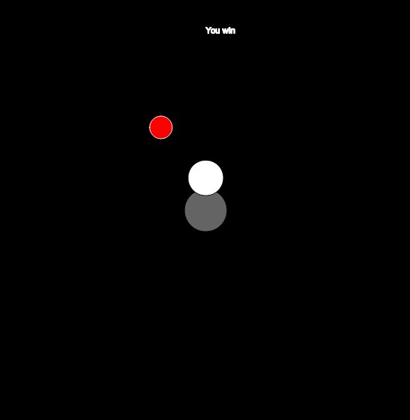
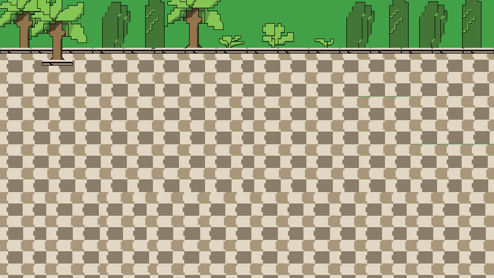
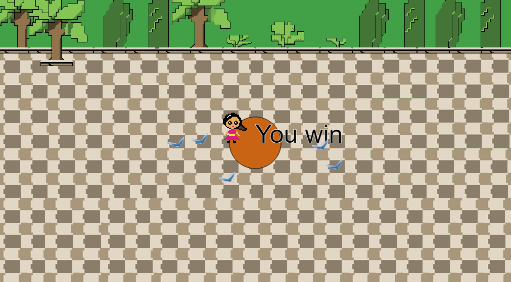
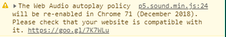
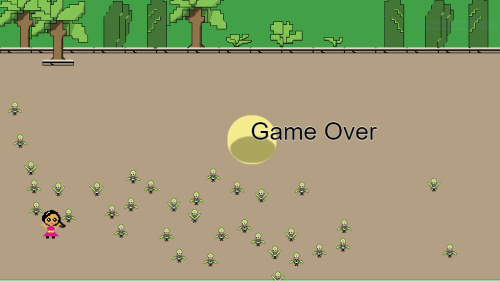
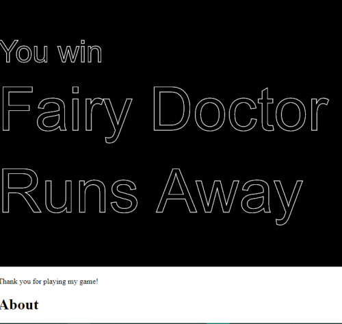

Julia Ballas 50

[link]https:

# Final Project

date 12-10-18

## Overview

My final project: Fairy Doctor Runs Away


## Projects

- player.js
- sketch.js
- enemy.js
- goal.js
- Sounds
- Images

## Workflow / Deadlines

1. Coding (Finish by November 27th)
    - Player movement (using `keyIsDown`)
    - Player interacts with goal
    - Enemy movement toward stationary target
    - Enemy movement toward moving target
    - Enemy interacts with Player
    - Random appearance on screen
2. Images / Sound (Finish by December 4th)
    - Lillia and Fairies
        - create pixel line art
        - color in Photoshop
        - Sprite animation/Sprite sheet
    - Background sketch
        - create pixel line art
        - color in Photoshop
    - Main Page
        - brainstorm ideas/draft
        - create Logo
        - draft line art
        - color in photostop
    - Add code for final sprites
    - Add code for background images
    - Sound
        - Search Hooksounds.com or Musopen.org offer for Creative Commons background music
        - Add code for background music
    - Add music to Main Page
        - Search Freesound.org for creative commons Sound effects
        - Add code for sound effects
3. Code Game Screens and About Page
    - Add a Start Button
    - P5.JS Dom elements for About page
    - Code different Game Screens 0, 1, 2 and connect using an if/else statment
4. Playtesting/Feedback (Send to people around December 5th)
    - Coding changes
        - Add left handed player controls WASD
        - Add a loading time. Display sprites, but don't let them move for X seconds
        - Add a button to restart game after winning
    - Add a Mute Button
    - Adjust volume of sounds
    - Change Main Page background, font style, add in controls and basic story.

5. Final proofreading and copy edits
    - Clean up Code
    - Finish Readme
    - Proofreading

6. Submit Final Project **deadline Tuesday December 11th, 8:00AM**

## Coding Phase 1

### Challenges in phase 1

### Solutions in phase 1

## Coding Phase 2

### Challenges in phase 2

### Solutions in phase 2

## Coding Phase 3

### Challenges in phase 3

### Solutions in phase 3

## Progress Report

### date: 11-21-18

**Summary:** After finishing up my proposal, I started working on first step: Coding. This included coding the player and making it move using `keyIsDown`, which is tied to each of the directional arrow keys. Right now I have the speed moving at 5, but this is quite fast. I may consider revising it.

Secondly, I worked on the 'Player interacts with Goal'. I finally feel like I have a grasp on everything we learned in Week 12. I have a seperate file for the player, and it interacts with another class known as Goal.

Next up is Enemy movement. I'm going to make a Enemy Class for my ghost. Possibly ghosts. But I will start with one ghost. I'd love to be able to have more than one, and they could appear randomly or two at once, for higher difficulty. But one thing at a time.

Later today I'm going to work on sketching and pixel art in Photoshop.

I reviewed a p5.js pacman game to see how the code for a game was laid out, and specifcially how the objects interact(1), and our week 12 lesson for interaction between objects(2).

### date: 11-23-18

**Summary:** I focused on making the enemy movement today. I want it to target the player, and I modified code from Dan Shiffman's Steering Behaviors. In his tutorial he discusses how the steering behavior, in this case a `seek()` function is defined by the simple equation of steering = desired velocity - current velocity (3). I used this in my Enemy.js file and now the object zips across the screen toward a stationary x,y position. Now the trick will be to get it to target a constantly moving position. I think I just need to put the current X,Y posistions into an array and then have the enemy target those numbers.

And I just discovered another problem. My goal function is not working. Somehow I deactivated that code so it doesn't recognize when the player reaches the goal.

Todo:

1. Add colors to objects, so I can identify them better.
2. Research code that targets a location that is constantly updating. Check the p5.js book as well as Dr. Musick's pacman and bubbles array for this behavior.

### date: 11-26-18

**Summary:** Coding the enemy movement turned out to be the biggest struggle so far. I managed to make the enemy target a stationary point, but I could not figure out how to make it target a moving object. I knew it had to be possible. As I researched into this I discovered various methods to target the mouseX, and mouseY, but I was determined to keep my movement tied to the keyIsPress. After researching more about steering, I discovered another example in Dan Shiffman's Nature of Coding that used steering to target specific dots on a screen. (4) That's when I finally had a breakthrough. The enemy is programmed to `seek(target)` using the variable `let target = creatVector( player.pos.x,  player.pos.y)`. That's all it took.

The screenshot below shows a winning screen, with the player(white) touching the goal(gray), after avoiding the enemy(red).



Here is the `draw()` function of my game:

```JS
function draw() {
    background(0);

    let target = createVector( player.pos.x, player.pos.y); // This creates the vector target that the enemy will seek. I didn't need an array to hold the pos.x,pos.x. I needed a vector.

    goal.displayPortal();

    player.display(); // Displays the player on screen
    player.move(); // Allows the user to control the player with keyboard arrows
    player.inBounds(); // Keeps the player inside the walls of the screen.

    reachedGoal();

    enemy.display(); // Displays the enemy on screen
    enemy.seek(target); // This uses the enemy's steering to seek out the target
    enemy.update(); // This controls how the enemy moves: the velocity and acceleration

    gameOver();

}
```

Next, I need to focus on concept art, and getting sprite animation. I'm looking forward to this part.

### date 12-3-18

**Summary**: Over the weekend I worked on my artwork, and I found pixel art as frustrating at the game. I was pretty satified with the tropical setting, until I added the sprites on top of it and did some play testing, now I hate the background. I'm going to make it simplier. The pattern I made at first is too jarring.



Other Image issues I need to address:

- Background should be simply black or a light brown color with some of the trees at top.
- Impilmenting my portal is not working at the moment. So I'm just using a p5.js circle as by portal.
- I also I realized my fairy's wing is cut off on the left, so I need to adjust the size again!

Other concerns: I'm also struggling with the 'hit boxes'. When I had the game as circles, I could definetely tell where the boundaries are, but with sprites I can't always tell. I wonder if I could layer a circle on top, to see the difference.

I'm going to have to post to the forum, or else find out when lab hours are this week, because I don't have any ideas how to fix this problem with 'hit boxes'.



My Todo List

- create a Main page and About page that will link to the main game. Using HTML? Or stick with p5.js?
- Start button
- restart button
- Obstacles?
- Can I add a text conversation game?

### date: 12-4-18

**Summary:**
I researched dialogue trees and discovered a wonderful program called [Twine](http://twinery.org), which allows you to create HTML based interactive fiction. This is too much work to try and add a second conversation based game in p5.js, so I'm just going to focus on getting the game to work properly.

I fixed the backgrounds, and figured out how to make my 'hit boxes work. I added in the test circles. This allowed me to see where the characters were hitting each other.


My solution was to change the `imageMode()`. The default is CORNERS, which specifies that the 2nd and 3rd parameters are attached to the upper left corner. When I changed to `imageMode(CENTER);` then the images are more like ellipses. Success! It fixed my hit boxes. Of course, after that I had to adjust my boundaries to make sure my sprite stayed on screen properly.

My next problem is adding the main page, and start game button. I looked over the Pacman game again (1), and started poking around on our github Issues forum. @HagenNataniel has been working on a trivia game, and there was a link to another p5.js game, which uses a Game Start screen, as well as the main game Screen.

Looks like I'm going to have to impliment an if/else statement and a game start button.

I reviewed more of Dan Shiffman's DOM videos, to see how adding HTML elements works in p5.js. When I tried to add HTML information straight to my index file, I didn't like the layout anymore. I also had to download the newest version of dom.min.js library because of an error with the button.

Lasty, I am getting warning from google about my audio playing automatically.


TODO:

- Add if/else statement to get game screen
- Button to start the game, and then when it's game over, to restart the game
- Credits/About page, because I need to give attributions for my audio files.

CONCERNS:

- How do I tell people what the best size for the game is?
- Im concerned about scalability. What if someone views this game on a phone? It wouldn't play.
- How do I change the background images from static to something that will adjust automatically to screen size?

### Date 12-5-18

**Summary:**
Today I updated my game to switch between a main page, the game and a credit page. I use an if/else if/else if statement to switch between each of the three 'pages'. The basic layout for this came from a p5.js game called Flappy Pong.(9)

There was some unexpected results. At one point the fairies kept multiplying over and over every time I lost the game. There were way too many.


There was an easy solution, I just had to make sure my enemy array was empty again whenever I restarted the game.

```JS
    else if( startingGame == 0){

        startScreenDisplay();
        fairies = [];
    }
```

I also made my About/Credits page today. I tried to keep it simple. In some ways I prefer the design of this to my pixelated background.



Today, I was ready to ask for feedback from friends and family, but I ran into a bigger issue. Whenever I try to view my game on the github webpage there is an error.


I have no clue why. Googling didn't reveal any solutions. I posted to the forum today to see if anyone else knows and I'll e-mail the TAs tomorrow. At this rate I won't be able to submit my project.

The game still works on my local server, but not on github. Not in Chrome or Firefox.

Next I could try to move the sound file from the sound folder for a direct path. It's worth a try.

## Date 12/7/18

**Summary:**

Sound fixed!
I managed to fix my sound errors by moving around the location of the sound files. They are directly in my JS folder, instead of inside a seperate one.

Feedback I got some feedback from my family on the game. Both my sisters complained abou the sound levels, so I changed the volume level to quarter, and added a mute button. The mute button appears only after you start the game, and effects both the sound effects and the background music.

My sister also described it as moving so fast, and it took my Dad 30-50 times to finally escape. At my sister's suggestion I decided to add a 3-2-1 start to the game. After some research, and more help from Dan Shiffman, I discoverd the setTimeout() function in JS (10). I could use this to have my sprites display, and then a few seconds later they start moving. This was so frustrating. I couldn't figure out where to put it, inside my Class funtions, or inside the main file. It was in the main sketch file, when I am displaying the enemy and player. Eventually, I discovered I needed to make more functions to call inside the setTimeout().

```JS
/********* Loading Timer Functions *********/

function loadingPlayer(){
    player[0].frame();
}

function loadingEnemies(target, fairies, i){
    fairies[i].frame(target);
    fairies[i].avoidOthers(fairies, i);
}
```
However, I also had parameters.
I googled a solution on this. I discovered where to put my parameters. (11)

```JS
setTimeout(yourFunctionReference, 4000, param1, param2, paramN);
```

This, gave me what I needed. Now, when you start the game there is a brief 'loading' before the fairies move. I need to add some text that say 'Ready? Start!' Or else adjust how long the 'loading' lasts. I think it might have effected my enemy vector, but I'm okay with that. 

I also discovered an interesting glitch. If you continue to hit the start button it spawns more and more fairies. Ah, ha! This is hard mode!

## date: 12-9-18

**Summary:** Today is my last progress report. I plan to change the font type on my main page, and tweek the timing for the sprites loading. Mostly, I am updating my readme file.

I fixed the workflow to reflex my actua progress, instead of a daily report, which is rambling and hard to follow. I am going to make the readme focus on Coding Phases 1-3, their challenges and solutions. I'll briefly discuss the images and sounds and how important it was to get feedback. So, I'm making this last report for my history. So, I have the record on file, but I'm removing it for my final submission. 

I will also try to clean up my code, check on the comments, and proofread.

Cheers! This was a great learning experience!

### Images and Sound


Using the `function preload()` I added in images for my fairies, and for Lillia, my main character. The trouble was getting used to drawing in the 8bit or pixel art style. I got some tips from youtube channel by blackthornprod. Each pixel has to do a lot of work, and typically 8bit games don't use very many colors (5).

As for animating, the advice I recieved was to keep my animations simple, like the artwork. After some experimenting I ended up with a very basic movement for both characters. Lillia's arms move up and down, and the fairies' wings flap up and down (6).

During my study of p5.js sound I watched more of Dan Shiffman's tutorials. In two different videos he gives some simple examples of adding background music, and adding sound effects to a game (7) (8). This was exactly what I needed. It was also very similar to preloading the image files. I feel like the beginning of my file has too many variables and preloaded images, but I'm trying to keep the file sizes down.

## Forum Issues

I've been helping people debug their code project. @JoleneTiffanyG had some small typos in her code I found. @HagenNathaniel couldn't get his code to display and I suggested he download the newest version of dom.min.js file, because of a button error.

## Feedback

## Conclusion

## Sources

(1) [Kuiphoff, John. "Pacman Game using p5.js". coursescript.com/notes/interactivecomputing/game/](http://coursescript.com/notes/interactivecomputing/game/pacman/sketch.js).

(2) [Musick, Michael. "Week 12 Bouncing Balls".  montana-media-arts.github.io/creative-coding-1/modules/week-12/objects-w-each-other/](https://montana-media-arts.github.io/creative-coding-1/modules/week-12/objects-w-each-other/).

(3) [Shiffman, Dan. "Coding Challenge #59: Steering Behaviors." The Coding Train. February 2017. www.youtube.com/watch?v=4hA7G3gup-4](https://www.youtube.com/watch?v=4hA7G3gup-4)

(4)  [Shiffman, Dan. "Coding Challenge 61.1: Evolutionary Steering behaviors - Part 1." The Coding Train. April 2017. www.youtube.com/watch?v=flxOkx0yLrY](https://www.youtube.com/watch?v=flxOkx0yLrY)

(5) ["How to draw pixel art game characters in PS - Tutorial" YouTube. Blackthornprod. May 2018. www.youtube.com/watch?v=qzvYu48kw5Q](https://www.youtube.com/watch?v=qzvYu48kw5Q)

(6) ["How to animate Pixel art Game Characters in PS - Tutorial". YouTube blackthornprod. May 2018. www.youtube.com/watch?v=mnJb5iwYAmg](https://www.youtube.com/watch?v=mnJb5iwYAmg)

(7) [Shiffman, Dan. "17.1: Loading and Playing - p5.js Sound Tutorial" The Coding Train. June 2017. www.youtube.com/watch?v=Pn1g1wjxl_0](https://www.youtube.com/watch?v=Pn1g1wjxl_0)

(8) [Shiffman, Dan. "17.5: Adding Sound Effects - p5.js Sound Tutorial." The Coding Train. June 2017.www.youtube.com/watch?v=40Me1-yAtTc&t=864s](https://www.youtube.com/watch?v=40Me1-yAtTc&t=864s)

(9) [Gelal, Oguz. "Flappy Pong". Github. gist.github.com/oguzgelal/a2a8db8b2da0e864d1d0#file-flappy_pong-js](https://gist.github.com/oguzgelal/a2a8db8b2da0e864d1d0#file-flappy_pong-js)

(10) [Shiffman, Dan. "9.4: JavaScript setTimeout() FUntion - p5.js Tutorial". The Coding Train. December 2015. www.youtube.com/watch?v=nGfTjA8qNDA&t=4s](https://www.youtube.com/watch?v=nGfTjA8qNDA&t=4s)

(11)["Vetyska, Jiri. "How can I pass a Parameter to a setTimeout - callback". Stack Overflow forum. Oct 30 2012 stackoverflow.com/questions/1190642/how-can-i-pass-a-parameter-to-a-settimeout-callback](https://stackoverflow.com/questions/1190642/how-can-i-pass-a-parameter-to-a-settimeout-callback)