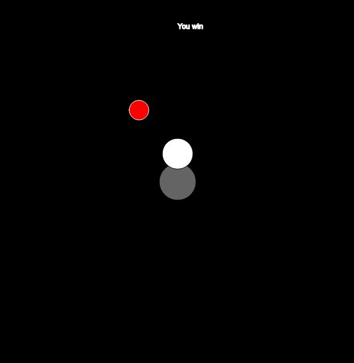

Julia Ballas 50

[link]https:

# Final Project

date

## Overview

Presenting my final project: Lucy and the Ghost of Garnet

TODO: LOGO for GAME

## Projects

- player.js
- sketch.js
- 

## Workflow / Deadlines

1. Coding (Finish by November 27th)
    - **Player movement (using `keyIsDown`)**
    - **Player interacts with goal**
    - **Enemy movement toward stationary target**
    - **Enemy movement toward moving target**
    - **Enemy interacts with Player**
    - **Random appearance on screen**
    - Obstacles
2. Sprites/ Concept Art (Finish by November 30th)
    - Lucy and Edith
        - **PS pixel line art**
        - PS coloring
        - Sprite animation/Sprite sheet
    - Background sketch
        - PS line art
        - PS coloring
    - Main Page
        - brainstorm ideas/draft
        - Logo sketch
        - line art
        - coloring
    - Add final sprites to game
    - Add final background to game
3. Main Page and About page (Finish by December 1st)
    - Draft main page layout
        - A simple p5.JS animation loop?
    - Write About page
    - Final sketch
    - Link Main Page to About and Game
4. Sound (finish by Decemer 4th)
    - Search Hooksounds.com or Musopen.org offer for free background music
    - Add background music to Game
    - Add music to Main Page
    - Search Freesound.org for creative-commons Sound effects
    - Add sound effects to game

5. Impliment other ideas?

6. Playtesting/Feedback (Send to people around December 5th)
    - From friends and family
    - GitHub forum

7. Submit Final Project **deadline Tuesday December 11th, 8:00AM**


## Progress Report

date: 11-21-18

**Summary:** After finishing up my proposal, I started working on first step: Coding. This included coding the player and making it move using `keyIsDown`, which is tied to each of the directional arrow keys. Right now I have the speed moving at 5, but this is quite fast. I may consider revising it.

Secondly, I worked on the 'Player interacts with Goal'. I finally feel like I have a grasp on everything we learned in Week 12. I have a seperate file for the player, and it interacts with another class known as Goal.

Next up is Enemy movement. I'm going to make a Enemy Class for my ghost. Possibly ghosts. But I will start with one ghost. I'd love to be able to have more than one, and they could appear randomly or two at once, for higher difficulty. But one thing at a time. 

Later today I'm going to work on sketching and pixel art in Photoshop.

I reviewed a p5.js pacman game to see how the code for a game was laid out, and specifcially how the objects interact(1), and our week 12 lesson for interaction between objects(2).

date: 11-23-18

**Summary:** I focused on making the enemy movement today. I want it to target the player, and I modified code from Dan Shiffman's Steering Behaviors. In his tutorial he discusses how the steering behavior, in this case a `seek` behavior is defined by the simple equation of steering = desired velocity - current velocity (3). I used the code in my Enemy.js file and now the object zips across the screen toward a stationary x,y position. Now the trick will be to get it to target a constantly moving position. I think I just need to put the current X,Y posistions into an array and then have the enemy target those numbers.

And I just discovered another problem. My goal function is not working. Somehow I deactivated that code so it doesn't recognize when the "player" reaches the goal. 

Todo:

1. Add colors to objects, so I can identify them better.
2. Research code that targets a location that is constantly updating. Check the p5.js book as well as Dr. Musick's pacman and bubbles array for this behavior.

date: 11-26-18

**Summary:** Coding the enemy movement turned out to be the biggest struggle so far. I managed to make the enemy target a stationary point, but I could not figure out how to make it target a moving object. I knew it had to be possible. As I researched into this I discovered various methods to target the mouseX, and mouseY, but I was determined to keep my movement tied to the keyIsPress. After researching more about steering, I discovered another example in Dan Shiffman's Nature of Coding that used steering to target specific dots on a screen. (4) That's when I finally had a break through with what I needed. The enemy is programmed to `seek(target)` using a creatVector. That's all it took.



Here is the basic code from the draw function of my game:

```JS
function draw() {
    background(0);

    let target = createVector( player.pos.x, player.pos.y); // This creates the vector target that the enemy will seek. I didn't need an array to hold the pos.x,pos.x. I needed a vector.

    goal.displayPortal();

    player.display(); // displays the player on screen
    player.move(); // Allows the user to control the player with keyboard arrows
    player.inBounds(); // keeps the player inside the walls of the screen.

    reachedGoal();

    enemy.display(); // displays the enemy on screen
    enemy.seek(target); // This used the enemy's steeting to seek out the target
    enemy.update(); // This controls how the enemy moves: the velocity and acceleration

    gameOver();

}
```

Next, I need to focus on the Art concept, and getting sprite animation. Then 

## Sources

(1) [Kuiphoff, John. "Pacman Game using p5.js". coursescript.com/notes/interactivecomputing/game/](http://coursescript.com/notes/interactivecomputing/game/pacman/sketch.js).

(2) [Musick, Michael. "Week 12 Bouncing Balls".  montana-media-arts.github.io/creative-coding-1/modules/week-12/objects-w-each-other/](https://montana-media-arts.github.io/creative-coding-1/modules/week-12/objects-w-each-other/).

(3) [Shiffman, Dan. "Coding Challenge #59: Steering Behaviors." The Coding Train. February 2017. www.youtube.com/watch?v=4hA7G3gup-4](https://www.youtube.com/watch?v=4hA7G3gup-4)

(4)  [Shiffman, Dan. "Coding Challenge 61.1: Evolutionary Steering behaviors - Part 1." The Coding Train. April 2017. www.youtube.com/watch?v=flxOkx0yLrY ](https://www.youtube.com/watch?v=flxOkx0yLrY)

## Conclusion
