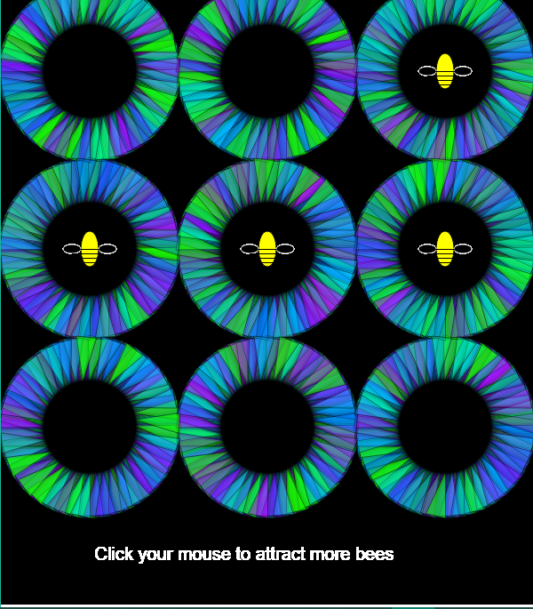
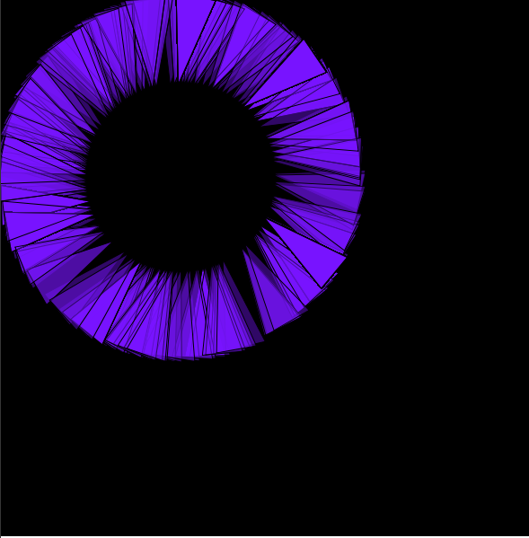
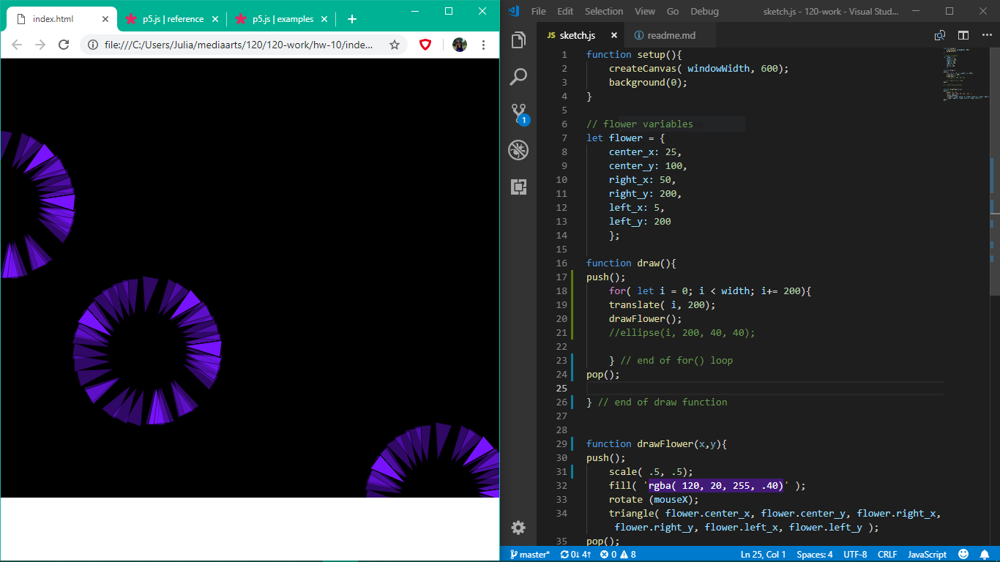
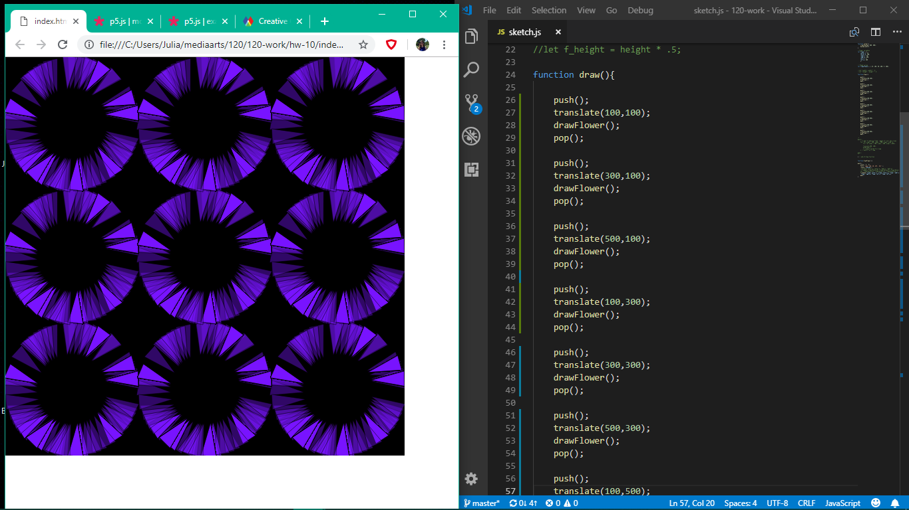
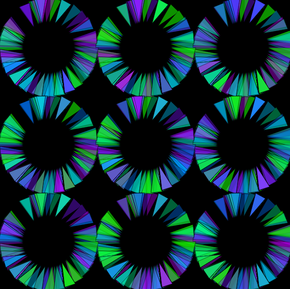
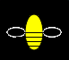

Julia Ballas 50

[Week10: Bee-utiful Flowers](https://jballas.github.io/120-work/hw-10/index.html)

# Week 10 Response

date 10/30/18



## Overview

Functions and Arrays. We didn't have homework during week 9, which is when we learned about Arrays. This week was all about functions and how to create your own. The goal with creating a function is to made your code easier to read, instead of putting everything in the `draw()` function.

## Projects

- hw-10

## Assignment

Use code from a previous homework, or create a new sketch that uses two functions and at least one array.



Here is the flower code from a previous sketch. I'm going to take this and make it a function for this week's homework.
```JS
push();
    translate( 200, 200);
    fill( 'rgba( 120, 20, 255, .40)' );
    rotate (mouseX);
    triangle( flower.center_x, flower.center_y, flower.right_x, flower.right_y, flower.left_x, flower.left_y );
pop();
```

## Weekly Report



Creating the flower function was a simple copy and paste task. The hard part came when I wanted to make multiple flowers. I added a `for()` loop, but I couldn't get more flowers until I used `translate()`. It was the first taste of success. Right at that moment, I knew I was getting closer to what I originally envisioned for this project!

Here's the code I added:

```JS
function draw(){
push();

    // I want to make my flower repeating
    for( let i = 0; i < width; i+= 200){

        //I was able to use translate to make my drawFlower function repeat.
        translate( i, 200);
        drawFlower();

    } // end of for() loop
pop();

} // end of draw function
```

Unfortunately, I had to modify this to get uniform flowers across the screen. I wanted them in a grid of 3 x 3, with different colors.

###  Coding Conundrums

I finally solved my `for()` loop problem. After struggling for two days I just used brute force code. I made one flower and copy and pasted it 9 times until I got everything exactly where I wanted.



Afterward, I reviewed my numbers and realized what was different from my `for()` loop. The numbers needed to increase by 200 and the `push()` and `pop()` needed to be right next to the `translate()`. Finally, I solved my mystery. One tiny change to the code made all the difference. The code looks cleaner too.

```JS
    // I want to make my flower to repeat in a 3 x 3 grid
    for( let x_pos = 100; x_pos < 600; x_pos +=200 ){
        for( let y_pos = 100; y_pos < 600; y_pos +=200){
            push();
                translate(x_pos, y_pos);
                drawFlower();
            pop();
        }
    }
```

### A Colorful Array



Next, I added an array called `petal_colors []` and put rgba strings inside the array. Then I added a random element to the colors. I finally worked out that I had to put my variable inside the `drawFlower()` function, instead of having it as a global variable.

### Bee Function



My third step was adding a second function. I decided to make a bee right in the middle of my flowers. 

1. Step one: create the shape of the bee and add wings and stripes.
2. Step two: Make a `for()` loop for the stripes
3. Step three: After trying variables, I realized I needed to have a parameter in my function for the bee's location.
4. Step 4: Bee's location

    - I had 9 spots I wanted to put the bee in:
    - After making a grid with the exact x, y locations I realized there was a clear pattern. I wanted them at 100, 300, or 500.

    | X,Y Locations |   | |
    | -------- | -------- | -------- |
    | 100, 100 | 300, 100 | 500, 100 |
    | 100, 300 | 300, 300 | 500, 300 |
    | 100, 500 | 300, 500 | 500, 500 |

    - I made an Array called `position[]` with the three variables, then I connected the Array to my bee function. The bee's initial location is in the middle.
    - I added a `mousePressed()` function so I could make the bee's location random when you clicked the mouse.

5. Step 5: I discovered a conundrum with my bees. Either the bees stayed permanently on the screen, or I could add a `background()` to my `mousePressed()` and wipe the sketch clean every time. I decided to go with the former.

### Final touchups

After reviewing my code, I decided to make the movement of the flower petals automatic, instead of having it tied to mouseX. Lastly, I added in instructions so anyone who views the sketch will know they should click the mouse to add more bees.


## Other Classmates Issues/discussions

On the forum, I noticed that @haleysunshine was missing one of the arguments in her star function.

## Conclusion

My two functions are very similar in this week's sketch. They are both drawings I call in the `draw()` function, but I found it very useful to repeat the process of designing a function, then slowly adding in variables and lastly integrating it with the rest of the sketch. This repetition really helped me understand what I was doing. I also kept better track of my workflow this week. So, while I was frustrated for several days, when I finally had a breakthrough I could look back and see what I had accomplished.

For weeks now I've been experimenting with rotating triangles, and this week I was finally able to get the code to do what I wanted, for the most part.

Coding really is a process, and while I still have to look up simple things like - what are the parameters of a `line()` - I also feel like I am getting better at the process.