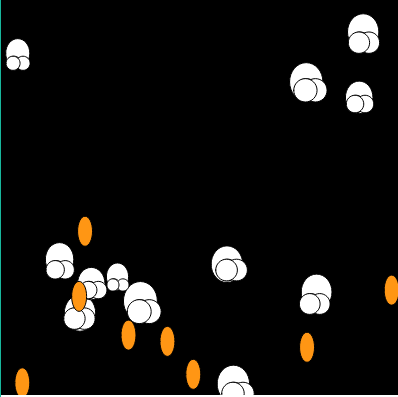

Julia Ballas 50

[Week 11: Popcorn](https://jballas.github.io/120-work/hw-11/index.html)

# Week 11 Response

date 11-7-18

## Overview

Object Oriented Programming is a new way of thinking about coding from the perspective of objects, their attributes and what they do. For instance, popcorn as an object comes in two shapes: seeds and popped. Before it becomes the popped shape, it heats up and then pops into existence.

## Projects

- Popcorn

## Assignment

Create a sketch with a class of 10-40 objects, each one with its own unique behavior, a constructor method and 2 methods that do something on screen.

## Weekly Report

### My Object

I'm going to make popcorn.
As an object it needs the following:

Attributes

- seed shape
- popped shape

Methods

- shaking (jumping, jittering, or heating up)
- popping (expanding or exploding)


### Embracing the Class

Over the last few weeks I had a typically workflow. When I start coding I first create the simple shapes and movement. I want to make sure I'm going to get them to display and to do what I wanted. Then I would add in variables, then recently I converted these into functions. This week I started off the same, but I  realized I was making more work for myself. Instead, I dived straight into the Class and attributes.

As a result, I felt like was mimicking Dr. Musick's code a lot more. I wasn't figuring out how to make the Array; I was just changing the names of it from dudes to bucket. I was copying the `for()` loops in `setup()` and `draw()` with my variables. Then I put in an `.frame()` because that's how I would call the specific methods I was creating for my popcorn.

Where was the code my own? When I tackled the math, and this I ran into a particular problem that took up all my time and was terribly frustrating. I never really came to a satisfying conclusion with my code, instead I compromised.

## Problems or Issues this week

### To Explode or not to Explode

I discovered two options for my popcorn: the popcorn could expand and explode, or it could Pop into existence. I couldn't figure out how to do both.

Here's a screenshot of the Exploding Popcorn pattern.


Here is the code:
```JS
    // I created a timed event, after 5 seconds the seeds expand, and "explode".
    //This is so disappointing, but I ended up being unable to use the timed explosion. Because after the explosion, instead of having random pieces of popcorn I would have a pattern of popped corn, uniform across the sketch.
    
    explodes(){
        if( millis() >= 5000 ){
            this.seed_size_w ++ && this.seed_size_h ++;
            
                if( this.seed_size_w >= 50){
                    background(bg_color);
                    for( this.loc_x = 0; this.loc_x <= width; this.loc_x += 50 ) {
                        for ( this.loc_y = 0; this.loc_y <= height; this.loc_y += 50 ){
                            this.poppedCornPieces();
                            this.poppedCorn();
                        }
                    }
                }
        }
    }
```
Since the exploding method didn't work like I wanted, I discovered I could put an `if` statement in my `heatingUp()` method.

Here is a screenshot of how the poppedCornPieces appear randomly on screen after the seeds disappear offscreen.



Here is the code:

```JS
        // Eventually the seeds wiggle off the screen and appear as poppedCorn.
        // Having them appear one at a time means they Pop into existence in a random pattern. This is what I want to happen.
        if( this.seed_y >= height ){
            this.poppedCornPieces();
            this.poppedCorn();
        }
```

## Specific questions/concerns for next week

For some reason I had trouble with GitHub this week, specifically when I tried to revert back to an older code. Either I was not saving my code enough to make this possible to revert back, or I don't understand how it works.

I also don't understand how branches work. I think it would have been helpful this week as I struggled between Exploding Popcorn and Popping popcorn. When should I branch my code? When I'm going to experiment? How do I do this?

## Conclusion

I found OOP useful, because most of my projects are about a certain object and making it do things, but I miss experimenting moments of pure delight when the code does something unexpected. Maybe I need to go back to algorithmic artwork, instead of trying to make simple animations like 'popcorn'.