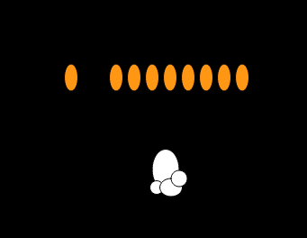
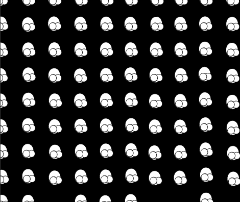

Julia Ballas 50

[Week 11: Popcorn]https://jballas.github.io/120-work/hw-11/index.html

# Week 11 Response

date 11-7-18

## Overview

Object Oriented Programming: a new way of thinking about coding from the presepctive of objects, their attribudes and what they do. For instance, popcorn as an object comes in two shapes: seeds and popped. Before it becomes popped, it heats up and then pops into existance.

## Projects

- Popcorn

## Assignment

Create a sketch with a class of 10-40 objects, each one with its own unique behavior, a constructor method and 2 methods that do something on screen.

## Weekly Report

### My Object

I'm going to make popcorn.
As an object it needs the following:

Attributes

- seed shape
- popped shape

Methods

- shaking (jumping, jittering, or heating up)
- popping (expanding or exploding)



### My


## Problems or Issues this week

### To Explode or to not explode 

I struggled this week with a particular problem. I discovered two options: The popcorn could expand and explode, or it could Pop into existance. I coudln't figure out how to do both.

Here's a screenshot of the Exploding Popcorn pattern.

```JS
    // I created a timed event, after 5 seconds the seeds expand, and "explode".
    //This is so disappointing, but I ended up being unable to use the timed explosion. Because after the explosion, instead of having random pices of popcorn I would have a pattern of popped corn, uniform across the sketch.
    
    explodes(){
        if( millis() >= 5000 ){
            this.seed_size_w ++ && this.seed_size_h ++;
            
                if( this.seed_size_w >= 50){
                    background(bg_color);
                    for( this.loc_x = 0; this.loc_x <= width; this.loc_x += 50 ) {
                        for ( this.loc_y = 0; this.loc_y <= height; this.loc_y += 50 ){
                            this.poppedCornPieces();
                            this.poppedCorn();
                        }
                    }
                }
        }
    }
```


## Specific questions/concerns for next week

For some reason I had trouble with github this week, specifically when I tried to revert back to an older code. Either I was not saving my code enough to make this possible to revert back, or I don't understand how it works. I also don't get how branches work. I think it would have been helpful this week as I struggled between Exploding Popcorn and Popping popcorn. When should I a branch? When I'm going to experiment? How do I do this?

I think I'm going to post about this on the forum to see what other people are doing.

## Other Classmates Issues/discussions


## Conclusion