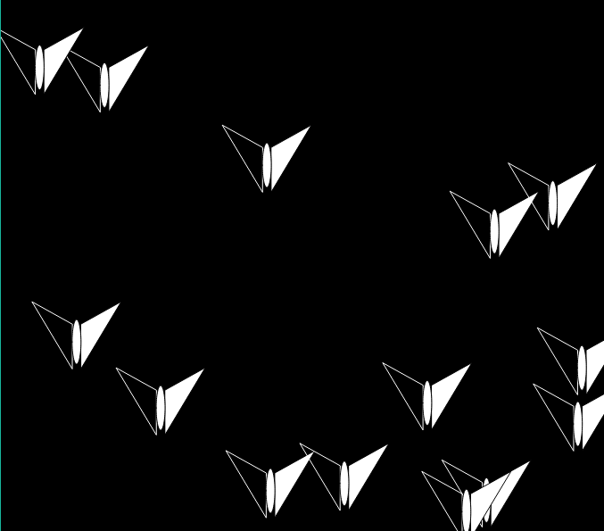
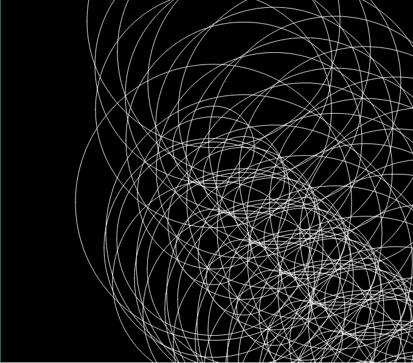
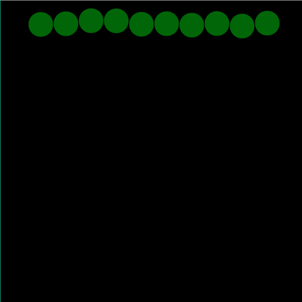
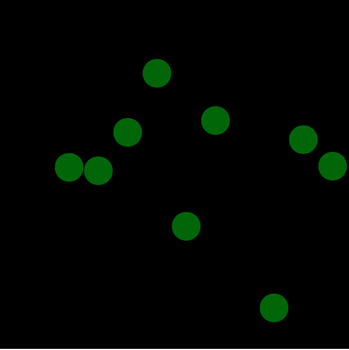

Julia Ballas 50

[Week 12: Spirals](https://jballas.github.io/120-work/hw-12/index.html)

# Week 12 Response

date 11-14-18

## Overview

This week we continued our study of OOP, focused on how our objects can be aware of each other and interact.

## Projects

- butterflies
- caterpillar
- wiggler
- hw-12: Spirals

## Assignment

Create a sketch with objects that interact with each other.

## Weekly Report

### Butterflies

Flapping wings was my first goal for this week. This quickly progressed into a butterfly, then multiple butterflies and a class called Butterfly.



[Butterflies Live Sketch](https://jballas.github.io/120-work/course-work/week-11-butterflies/index.html)

And then, the struggles began.

## Problems or Issues this week

### Caterpillar Experiment

I was trying to come up with a caterpillar that would wiggle across the screen. This experiment did not end like I wanted at all. At first I couldn't even get the caterpillar to show up, then I couldn't get it to wiggle like I wanted. It was flowing off diagonally, instead of straight across the screen. I reached a point where it no longer felt creative. I reached a point where it no longer felt creative. I was obsessing over the numbers, specifically how can I make ten ciricles wiggle  across a screen, like a caterpillar? But I was so focused on these objects and their interactions that I'd lost something important. The delight of discovery, the wonderful moments when the code will do somethign unexpected and strange. Why did the code have to do what I wanted? Why couldn't it could be something else?

I decided to abandon my caterpillar idea.

I kept the `class Caterpillar`, instead of renaming it ripples or something closer. Instead of bouncing off each other, I have the circles grow to a certain size and then start over. It fascinating to watch, and completely expected. I put my class into a separate file called it caterpillar.js, and I  linked this inside the index.html file.

```html
    <head>
        <meta name="viewport" width=device-width, initial-scale=1.0, maximum-scale=1.0, user-scalable=0>
        <script src="p5_lib/p5.min.js"></script>
        <!-- <script src="p5_lib/p5.dom.min.js"></script> -->
        <!-- <script src="p5_lib/p5.sound.min.js"></script> -->
        <script src ="caterpillar.js"></script>
        <script src="sketch.js"></script>
        <style> body {padding: 0; margin: 0;} </style>
    </head>
```
Screenshot of my sketch this week.



### Caterpillar revised

However, after I completed the homework's basic requirements, I went back to the caterpillars. My obsession was not over. I pulled up older code and started again. I was going to make these circles wiggle.

[The Wiggler](https://jballas.github.io/120-work/course-work/week-11-wiggler/index.html)



Unfortunately, despite the wiggling motion across the screen, I could not make the caterpillar appear anywhere else on screen. I wanted to see it wiggle into view randomly. When I tried its body fell apart completely.



I have no idea why. This is so frustrating, and it's still not creative. It's just objects that don't mean anything to me. It's numbers and posistion. So I did not submit this failed project. I did not make my caterpillar wiggle off screen and reappear as a butterfly. Perhaps I will try to finish this project on my own.

## Other Classmates Issues/discussions

I helped @MorganLong26 and @EmileeK with some troubleshooting.

## Conclusion

This week drained me of creativity. Object Orientated Programming feels less and less creative to me. There is no creative process. It's technical. It makes me focus on an aspect of coding that is logic and math based. It feels like busywork. When I decided to stop controlling my code, then I felt like I was making art, and not just programming a robot.