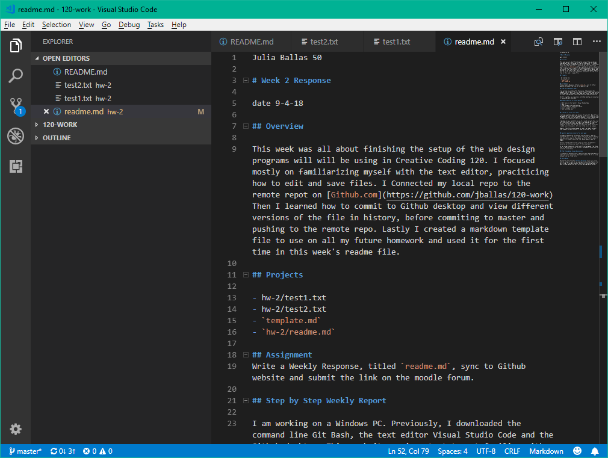

Julia Ballas 50

# Week 2 Response

date 9-4-18

## Overview

This week was all about finishing the setup of all the web design programs we will be using in Creative Coding 120. I focused mostly on familiarizing myself with the text editor, praciticing how to edit and save files. I connected my local repo to the remote repo on [Github.com](https://github.com/jballas/120-work) Then I learned how to commit to Github desktop and view different versions of the file in history before I commit to master and push to the remote repo. Lastly, I created a markdown template file to use on all my future homework assignments and used it for the first time in this week's readme file. 

## Projects

- hw-2/test1.txt
- hw-2/test2.txt
- `template.md`
- `hw-2/readme.md`

## Assignment
Write a Weekly Response, titled `readme.md`, sync to Github website and submit the link on the moodle forum.

## Step by Step Weekly Report

I am working on a Windows PC. Previously, I downloaded the command line Git Bash, the text editor Visual Studio Code and the Github desktop. This week it was important to get familiar with all these programs and practicing connecting and syncing files. 

First, I created a new repository on my Github Desktop and connected it to my 120-work folder. The path /c/users/Julia/mediaarts/120/120-work.

### How to Commit Files on Github Desktop

1. Edit files in text editor: Visual Studio Code
2. Save it
3. View changes in Github Desktop
4. Write a summary, and a description.
5. Select 'Commit to master'
6. Push to Github.com

### Screenshot of text editor

I am adding my final edits right now in a web browser, checking my spelling and syntax of this markdown file and making sure my image is linking correctly. Then I will submit this homework.

## Problems or Issues this week

I noticed something odd in my history of test1.txt. When I first uploaded the file it did not save the entire file, only one line. I had extra lines with my name on them and I'd just removed some of them before selecting commit, which it also shows in my history. 

I decided to do a test2.txt to see if I could recreate this, but unfortunately I could not. At least it allowed me to practice further. I also discovered how important it is to get your summaries correct, and that you only have one chance to do this. I added several documents, but only listed one in my summary.

However, then I discovered a way to revert my commit and edit that summary and description. I need to be clear as I can.

## Specific questions/concerns for next week

Although I have gotten the hang of the text editor, and how everything syncs. I am unsure about some specific details, like what colors mean on the sidebar. I think if it is green it means I still have to save the file. Blues means I haven't yet to commit. The color differences between the text editor and the Github desktop add to my confusion, but I suspect I will get used to them in time.

Second, although I discovered a way to revert, I completely messed up my history as a result of this experiment.

So far using Windows and slightly different programs from those that Dr. Musick uses in the lectures, and demonstrations has not caused me any problems.

## Other Classmates Issues/discussions

I responded to @JoleneTiffany's question about downloading p5.js, asking for more information about what computer OS she is using and what she has tried to do.

## Conclusion

Now that I understand how **Github Desktop** works as a visual control system, I want all my programs to have this feature; for my writing, for graphic design, basically everything needs to have a cloud backup, but with a local editing option as well.
