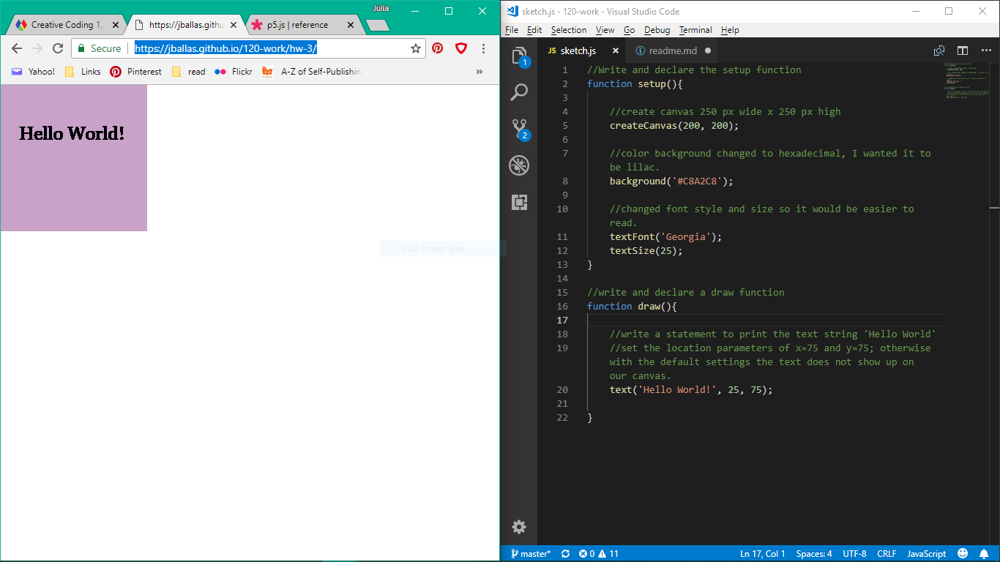

Julia Ballas, 50

[Hello World!](https://jballas.github.io/120-work/hw-3/)

# Week 3 Response

9-11-18

## Overview

This week felt very impowering. For the first time I felt like I was programming by myself, and knowing what I was doing, and not just mimicking someone else's guidelines. I have attmpted to learn how to code before, and made Hello World program, which is traditionally the first program everyone creates first. Perhaps working with the p5.js canvas made a different. To sum it up, this week I used javascript language and created a static webpage.

## Projects

- 01_hello-word
- 02_hellow-world
- 04_canvas
- hw-3/sketch.js
    - Hello World final sketch
    - live webpage

## Weekly Report

We were given an empty-example folder this week so we could begin programming in p5.js right away without having do more setup of files, such as the sketch file and index file and connecting those to the p5 library.

This allowed me to focus on learning the language of javascript, and the basic requirements in a javascript program.

P5.js programs typically have a set-up function at the top and then a draw function below for the actual drawing. Comments are used to provide more information about your project for anyone else reading the code. 

### How to program in 5 easy steps

1. New folder created with empty sketch.js, and index.html, etc.
2. Added setup function,  and set canvas size 
    - canvas size in p5.js defaults to 100 x 100 px
3. Added draw function with text 'Hello World' in a specific posistion
4. Customized background color and font style and size
5. commit and push to Github.com

### Static Webpage

After saving my repo to github website, the next step was to make it a live webpage. This involved going under settings and activating my github pages.

Github generously provides server space for this purpose.

## Problems or Issues this week

I took a break after finishing part 1 of this week's lesson. I like to give myself a few days to process everything I learn and then when I came back I review it with fresh eyes. I usually finish up my homework on Tuesday morning. However on 9-11-18 around 9am GitHub .com was down. I couldn't access my repo. According to the github status page they wre aware of the issue and in the process of fixing it. I had to wait an hour until I got access, but whenever the a website goes down it causes a panic. What if it never comes back? I couldn't even access the issues forum to discuss this with anyone. Luckily it resolved itself, and I still had the rest of the day to finish my homework and upload the webpage.

When customizing my Hello World program at first I was unable to change the font style and sizing. Then I realize I was putting the textSize and textFont in the wrong section, under the draw function and it need to go above in the setup. Then it worked like I wanted it too.

## Specific questions/concerns for next week

While working on the simple Hello World text program I immediately wanted to animate the text. I looked through the p5 library at examples, but felt very confused and uncertain. Especially when I looked at the mouseMoved function. The reference page mentioned variables and the values and it didn't make much sense to me. I eventually was satisfied figuring out how to adjust the font size and style. Now I'm skeptical about drawing using only number values and shapes, and wonder whether this will feel like meaninful art to me.

## Concludsion

Programming in javascript is intimidating, but understanding the logic behind it makes it much easier. Knowing that a program begins with a setup and then the drawing follows makes sense. I plan to utilize the comments to write todo lists for myself and as a reminder for what I was working on.