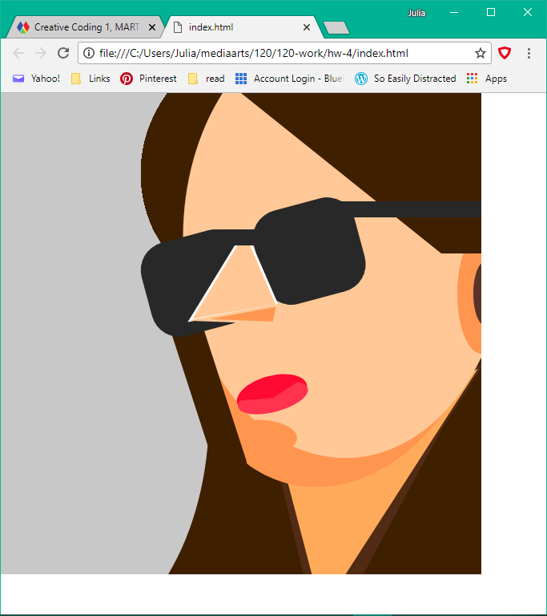
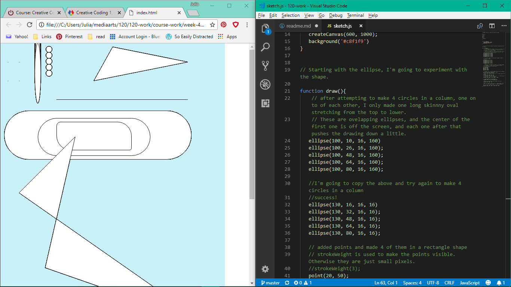
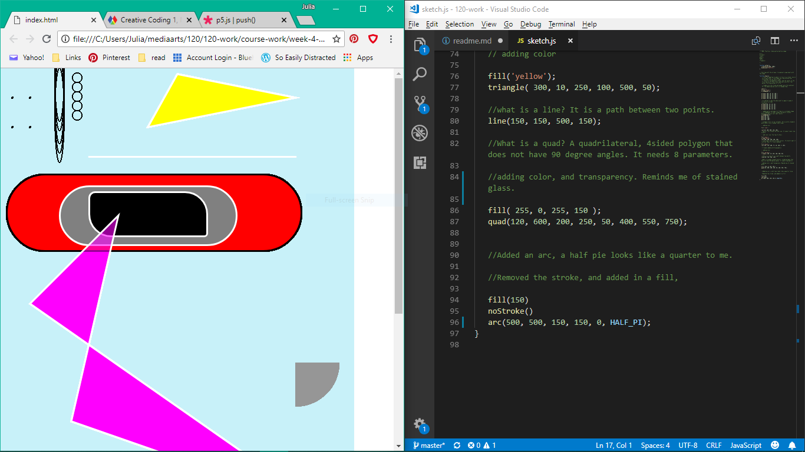
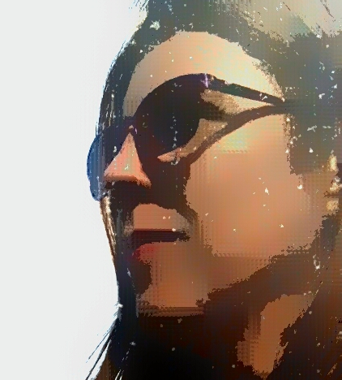
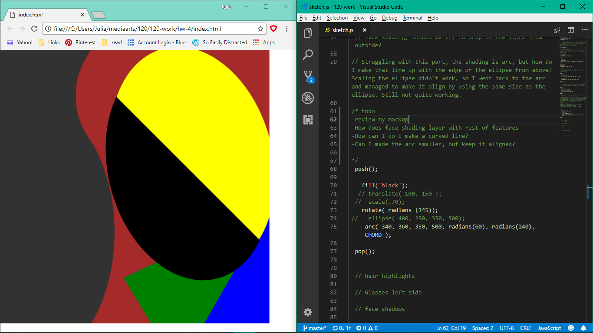
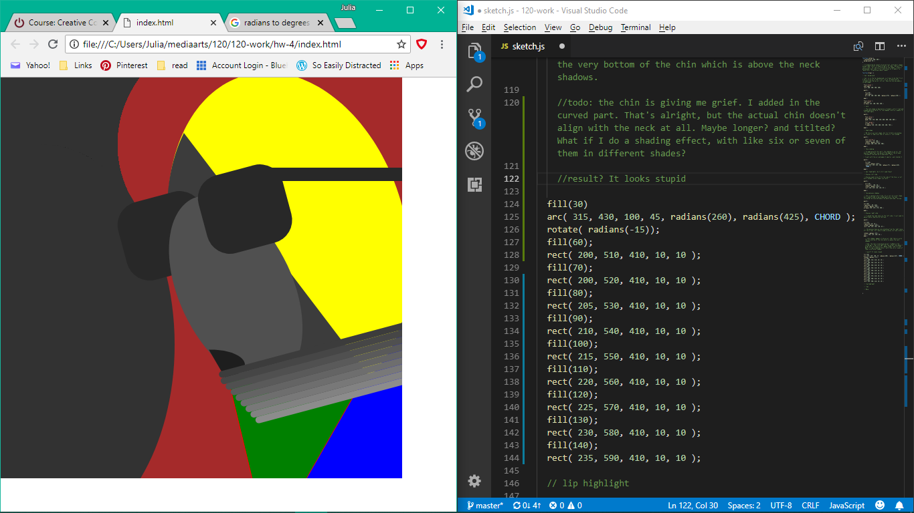
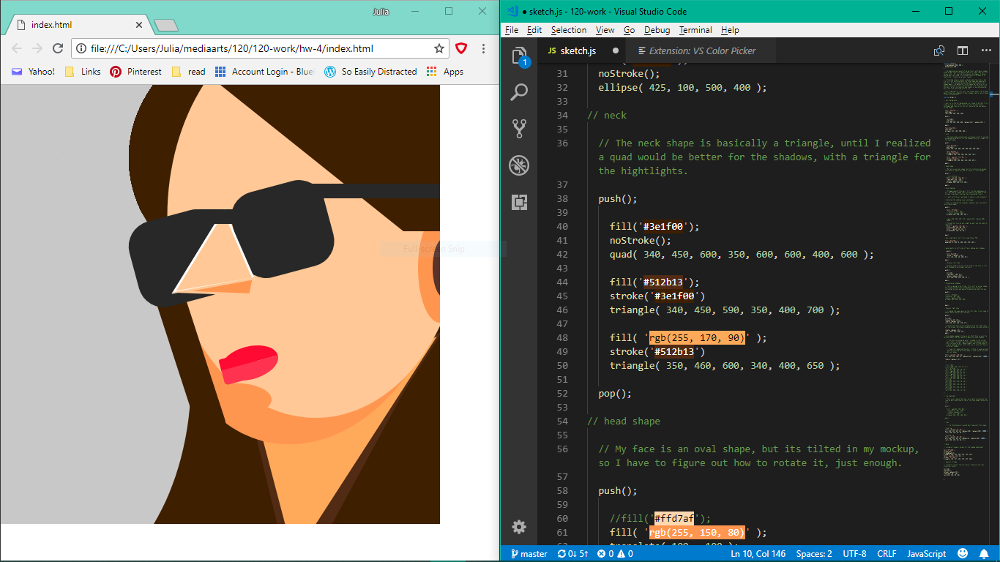

Julia Ballas 50

[Julia's Portrait](https://jballas.github.io/120-work/hw-4/index.html)

# Week 4: Shapes and Color

date 9/18/18

## Overview

This week we focused on learning the p5.js computer language. We studied basic shapes, such as ellipse, rectangles and arcs. We learned how to add color to these, and to manipulate their size, shape and placement on the canvas and the importance of order of operations in your code. This was put to practice by making a self portrait.

## Projects

- week-4-practice sketches
- hw-4/mockup.jpg
- hw-4/sketch.js
- final-portrait.PNG

## Assignment

 A self portrait



## Step by Step Weekly Report

### How to make a p5.js Portrait in 5 steps

1. Practice making shapes
2. Sketch a mockup of your portrait (I used a photoediting program)
3. Review your mockup for the basic shapes you can recreate in code
4. Code your shapes first, begin from the background and moving forward
5. Add color using RGB or HEX

### Practice

First, I began with of study each shape available in the p5.js library. I needed to learn what the code created, the input parameters and how to use it.
```
- ellipse()
- line()
- point()
- quad()
- rect()
- triangle()
```


#### notes after Practicing shapes

I experimented with shapes, and pulled out my calculator for the first time to be precise when placing my column of ellpises. I confused myself at first about the xy location parameters, as opposed to the width and height parameters. But even my mistakes are interesting. The Quad is intimiadting, using 8 different parameters. I winged it and then played around until I had an hourglass shape that stretched off the screen.



#### notes after practicing color

Adding color with the ```fill() ``` function and the ```stroke() ``` function gave me some headaches. The order of operations confused me because when I placed a strokeWeight function below the ellipses it still applied the heavier weight to everything. I fixed this by adding in more details. The transparency gave me grief too, since I got confused about when to use commas and when to leave them out of a function.

Next up is Portrait practice. I'm going to do a rough draft based on a idea I have and then I'll work on my final. I'll break it down into sections for the head, eye, nose, etc. Keeping an eye on the order of the shapes will be tricky.

### Mockup and Bright Face

A portrait means to me a closeup. I chose a selfie I took earlier this year during a trip to the Netherlands. It more dramatic and I'm looking off to the side. I changed the contrast, and added a filter to make it 'watercolor' style. My goal was to get at the basic shapes of my face.



Once I had this mockup, I reviewed the shapes, and came up with a lovely portrait with bright colors. I almost prefer this one to the more minimalist-style I ended up with. I reminds me of a cartoon.



## Problems or Issues this week

After Dr. Musick's warning about errors, the first time my preview went blank I didn't panic. I made sure I had all the commas in the right place. Occasionally I'd forget to capitalize a ``` strokeWeight ```, or I'd mispell ``` translate ```. It was always little details, but I was able to problem-solve myself.

Most fo the struggle this week was with the art. I'm still learning basic drawing techniques, so this was excellent practice on studying shape, shadows and highlights. I could not get the chin of my portrait to work out. This was one of my attempts. I look like I'm choking on a scarf.



Eventually, I managed to use two ellipses to make a shadow along the left side of my face and somehow managed to make a chin with an arc. I continued to experiment with details and all my attempts to make my portrait smile failed me. Eventually, I reached a point where ever change made the portrait worse. So there is very little difference between my final sketch and when I first added the color. Just the lips are different.



What frustrated me the most was tweaking the code. I felt like I would drop in a shape and then change one parameter, preview it, change it slightly more, and preview. It didn't feel like coding, more like a very boring limited art software. By the end I wanted to make an interactive grid where I could click on it and have it tell me the x,y coordinate; instead of me just guessing and then make dozens of tiny adjustments.

## Specific questions/concerns for next week

How will we move beyond basic shapes to coding? I'm curious about directional light. How could I have applied light to my portrait? So instead of having to draw shadows, the light would make them. Can you make a reflective surface? Like light shining off sunglasses? This sounds like complicated coding. I haven't studied math in years, hopefully the math part of coding will not overwhelm me.

## Conclusion

I am satisfied with my portrait, but I had further ideas about shape I wanted to explore. My favorite traditional art medium is pastel. I love being able to blend and mix all kinds of colors to get the right shadows and highlights. I think I was trying to achieve something similiar here. I would have liked more time to explore the shapes, but without the fuss that coding requires. Minimalistic painting is not my favorite, but I can appreciate the idea behind it.