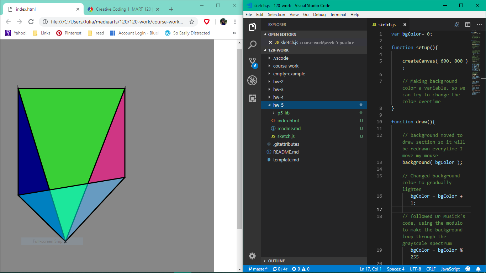
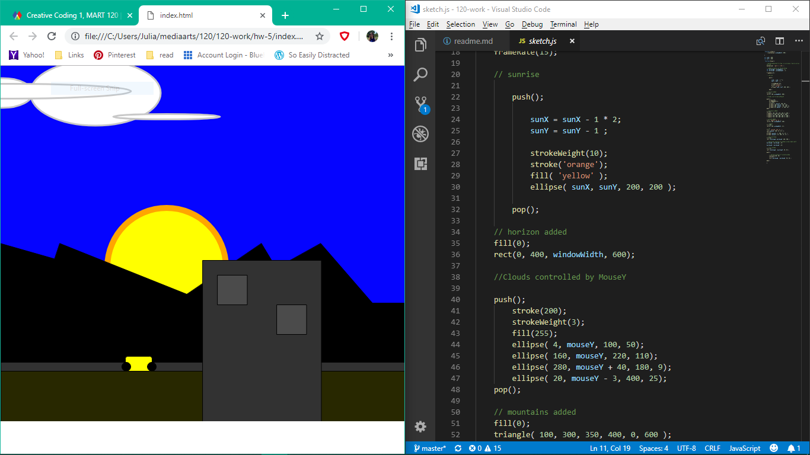

Julia Ballas 50

[Timelapse Sketch](https://jballas.github.io/120-work/hw-5/index.html)

# Week 5 Response

date 9-25-18

## Overview

This week we animated our sketches. I've been excited for this part from the beginning. Finally some movement. I applied variables to my code and explored various way to use the mouseX and mouseY parameters.

## Projects

- 3D pyramid
- Timelapse sketch

## Assignment

Create a sketch that moves, or an absract image that changes over time.

## Weekly Report

### Practicing variables and simple math



In my first experiment I made a 3D pyramid, and it surprised me when I first tested it. It stuck to my mouse! At first I struggled with making the shapes, but using variables was tremdously helpful in getting all the corners of the pyramid to align. Next I used the mouseX and mouseY on just the top of the pyramid and that let me animate it and move it around my canvas. When designing it I used alpha values on three of the sides, so it showed off the 3D shape. I was super impressed by how it all came together.

My next experiment was to recreate the background color changing, and I struggled with where to put my background variable. The Variable Scope still confuses me.

Here is a link to the practice experiment: [3D pyramid](https://jballas.github.io/120-work/course-work/week-5-practice/index.html)

### Sketch

I made a sketch with a building and mountains and then I added a sunrise. My car is controlled by mouseX and my clouds by mouseY parameters. The sun just drifts off to the left and disappears.

However, I wanted to make the scene dynamic. I couldn't discover a method to make the sky change color, but adding the clouds gave it a a sense of time. Having one car attached directly to my mouse felt like I had too much control, so I added a second car and attempted to make it drive backwards.



## Problems or Issues this week

I discovered a method for inverting mouseX and mouseY on the p5.js website, regarding the [Invert Mouse](https://p5js.org/assets/learn/interactivity/) option. However, even using a ```push()``` and ```pop()``` it effected both of my cars. Ultimately, I decided just to speed up the movement by multipying the mouse speed. When I used a simple equation: ```mouseX = mouseX * .70;```. It only made the movement accelerate, but when I used a more complex equation, adding and multiplying, then I caused the images to stutter and the illusion that they are speeding across the highway.

I used this equation to speed up my red car:

```mouseX = mouseX + (mouseX * .70);```

For the yellow car, I gave it a slightly slower speed, hoping to have both cars overlap occationally.

```mouseX = mouseX + (mouseX * .20);```

## Specific questions/concerns for next week

I realized something about **simple math**. It is easy to understand, but I struggle with applying it. I don't think in math terms of dividing and multipying, or even more complicated logic. Using variables made sense to me immediately, but not the math. I tested various equations, adding, subtracting, dividing and multiplying, until I got the effect I wanted. It was more like math by happy accident, than a deliberate decision.

 I sketch and write using my intuition. So, I had various ideas for my homework this week, but I was soon frustrated by what I knew I could do, (like a make a triangle) ad knowing there is so much more I don't know, such as making lots of triangles in a repeating pattern, or have my animation loop. I practiced making a flower pattern, but I'm saving it for next week to see if I can explore more animation options with it.

## Conclusion

Animation changes a sketch in terms of time, but also in how you think about it. It can change because of your imput, because your mouse is moving around, or because of a math equation within the code. When you animate something with code you have to consider movement: how it moves, where it moves, and it feels a bit tedious. What I enjoy is the liberating feeling of experimenting, when you don't know how your code is going to work exactly, or whether it will turn blank because you misplaced a semi-colon. There is a sense of wonder, or anticipation. What will happen when you hit the refesh button? Are you about to discover something unexpected in your code? There is only one way to find out.