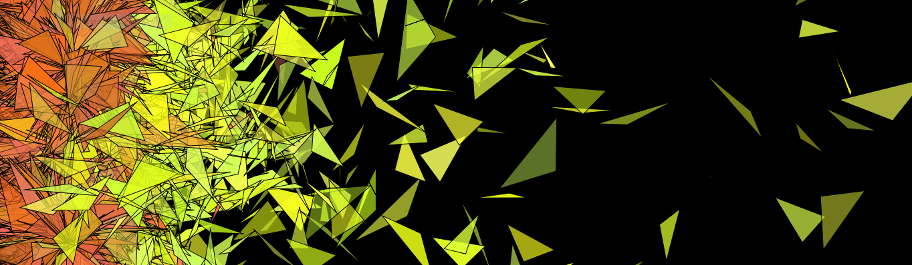
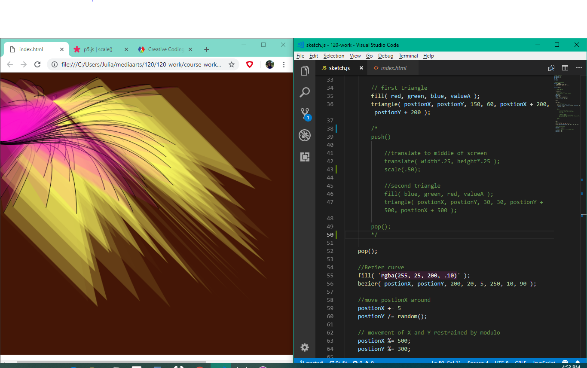
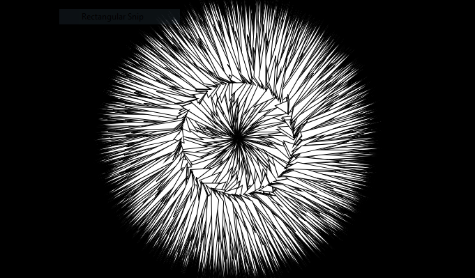
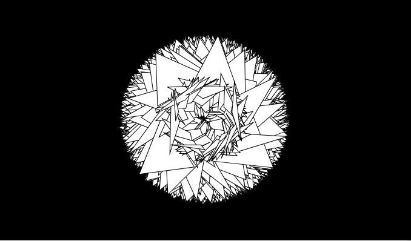
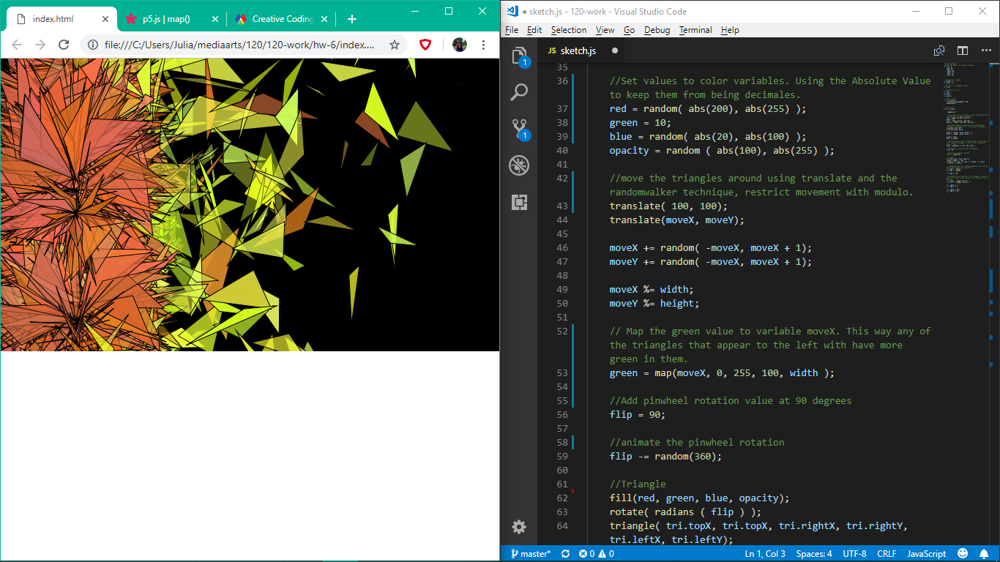

Julia Ballas 50

[hw-6: pinwheels](https://jballas.github.io/120-work/hw-6/index.html)

# Week 6 Response

date 10-3-18

## Overview

This week we continued to explore math functions in p5.js. Randomness was unleased upon my sketch and mapping should have made things easier, but the concept is hard to grasp.

## Projects

- math practice, sunbeam, tropical flower
- hw-6: pinwheels

## Assignment

Create an algorithmic art sketch.

## Weekly Report

## Practicing with Bezier curve

My first day of practicing with the math functions I pulled some previous code, which had lines and a bezier curve. Last week I did a simple addition to the code, and it created a simple pattern that quickly ran out of room. So, by adding in different restrictions, the modulo is very handy for this, and some random numbers I could make a much more interesting evolving pattern. Not sure if it counts as an algorithmic art. Figuring out how to make the alpha values random was tricky, but I referred to Dr. Musick's code to get my variables to work inside a `fill()`.

## What is Algorithmic Art?

According to the wikipedia page Algorithmic art is "computer generated art", where the design is "generated by an algorithm". (en.wikipedia.org/wiki/Algorithmic_art). I spent most of the week trying to decide if what I was created fit in that category. I explored various effects. Since I decided on a rotation and triangles, most of my earlier versions looked like flowers: a dandelion or a rose.

## Random chaos

I used the `random()` function everywhere, in my colors, the alpha value, as a random walker, in the rotation, and the size of my triangle. It was refreshing to have only one shape to work with, and yet still fill the canvas.

There are the functions I used in my hw-6:

- `random()`
- `abs()`
- `floor()`
- `+=`
- `%=`
- `map()`
- `-=`
- `/=`
- `*=`

## Problems or Issues this week

## `map()` function 
The lecture notes, including Dan Shiffman's video, only showed an example of the `map()` function using `mouseX`. I did not want `mouseX` in my sketch, so I had to puzzle out what other value I could manipulate, and eventually settled on my a color valuable.

I mapped the green variable to appear on the left side of the canvas. Here is the code: 
`green = map(moveX, 0, 255, 100, width );`

It appears to work as I intended. I think I made my sketch difficult because I had both a `rotate()` and `translate()`. The `translate()` function was the only way I could figure out to move my triangles around the canvas. I'm sure there is a more efficient method for this. I would have preferred the triangles behave like a single object that drifted around the screen.

## Too many math operations in one sketch

If the homework requires us to have several different variables, or more p5.js functions than I am comfortable with in one sketch, then I will tackle the project differently. I'll make four quadrants and in each explore a different math function, essentially 4 different sketches in one canvas.

## Other Classmates Issues/discussions

@HagenNathaniel posted a problem about his `let` functions not working. I noticed a few capitalization issues within the variables and let him know. The difference between `let` and `var` is still confusing. I typically stick with `var` in my code.

## Conclusion

I did not have a clear vision this week for my sketch. The more I added to it the less control I had over it. Perhaps this had to do with all the randomness. It felt more like I was just experimenting and not actualizing my ideas.