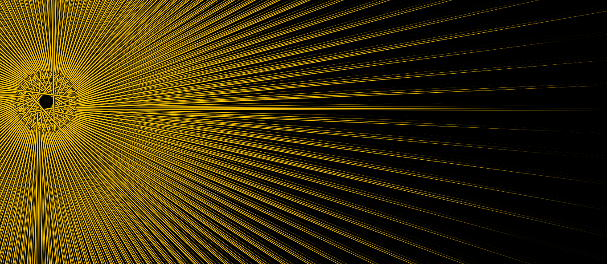
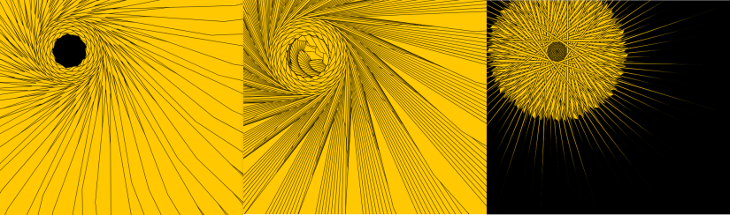
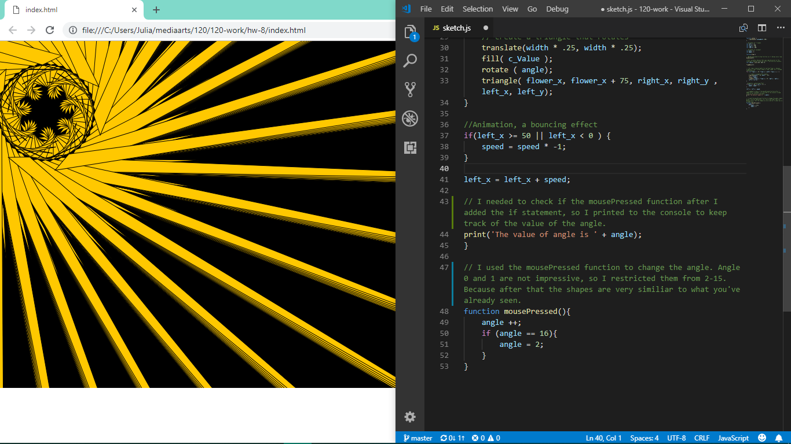

Julia Ballas 50

[Sunbursts](https://jballas.github.io/120-work/hw-8/index.html)

# Week 8 Response

date 10/17/18



## Overview

In week 8 we learned about other loops besides the `draw()` function. The `for()` loop and the `while()` loop allow you to make a pattern with your code.

## Projects

- Sunbursts
- ideas/practice

## Assignment

Use a `for()` loop to create generative art, animated figures, or the beginning of a video game.

## Weekly Report

This week I did got closer to actualizing an idea. The math equations are still a guessing game to me. I adjust one variable, and then experiment with another. I change the numbers and see how it affects the sketch, and I continue to do this until I am satisfied or pleasantly surprised. I'm finding this process hard to quantify or capture. It is all experimentation.

However, when I encountered a problem at the end of my project, I finally had a breakthrough where I understood exactly which code to use to make my idea work and it worked.

### Experimenting with Triangles

In Week 6 I took a rotating triangle and added randomness and other math features to make an algorithmic art. This week I took the same basic idea, but placed it in a `for()` loop to see how the triangular rotation could be repeated.

```JS
for (let flower_x = 25; flower_x < width; flower_x ++ ) {

    // create a triangle that rotates
    translate( width * .25, width * .25 );
    fill( c_Value );
    rotate ( angle ); // I used a single number at first for the static designs, then switched to a variable later on.
    triangle( flower_x, flower_x + 75, right_x, right_y , left_x, left_y );
}
```

I ended up with some interesting static designs.



### Adding `if()` statements

It wasn't until I added the `if` statements that I was able to animated my design how I wanted. I did a bouncing effect, like the bouncing ball from week 7's code to make the sunburst fade in and out.

```JS
//Animation, a bouncing effect
if(left_x >= 50 || left_x < 0 ) {
    speed = speed * -1;
}

left_x = left_x + speed;
```

## Problems or Issues this week


- I noticed whenever I changed my angle, I would have a completely different pattern, and I wanted a way to rotate between these patterns. I tried using a modulo. I tried using another `if` statements on the angle variable. None of it worked. I spent most of my time struggle with this problem. Finally, I realized I needed to use a `mousePressed()` function to switch between the designs manually. This way you can discover your favorite and watch each of them fade in and out.

- Some angle values did not make any patterns at all, and I had no idea why. Angle 0, seems obvious, that's just my triangle, but why angle 44, angle 88? And why do some patterns look so similar? I have no idea what my math is doing.

## Specific questions/concerns for next week

As I researched my problem with the angle and the animation, I discovered that we're eventually going to make our own functions. And I realized that this might be what I wanted to do all along. So I'm really looking forward to Week 10!

I'm really concerned about my final project. I have such frivolous ideas, and I'm not sure if any of them will be big enough to consider a final project.

### Goals for next week

- cleaner code
- track my design progress / workflow

## Forum Questions

Color variable are a tricky situation, but I used one in my code this week since the forum had a discussion on `color()` and `rgb()` variables.

I also tried to help @HagenNathaniel with his project, suggesting he use a `for()` loop to make a pattern with his ellipses.

## Conclusion

With `for()` loops and `if()` statements at my disposal I feel like I am being creative with code, and not just throwing math and shapes into a program.