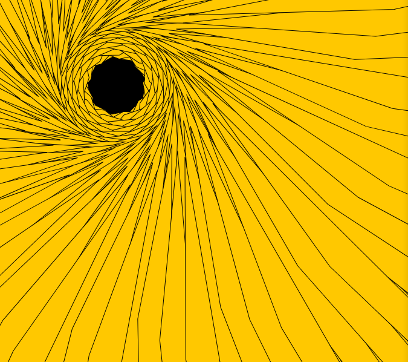
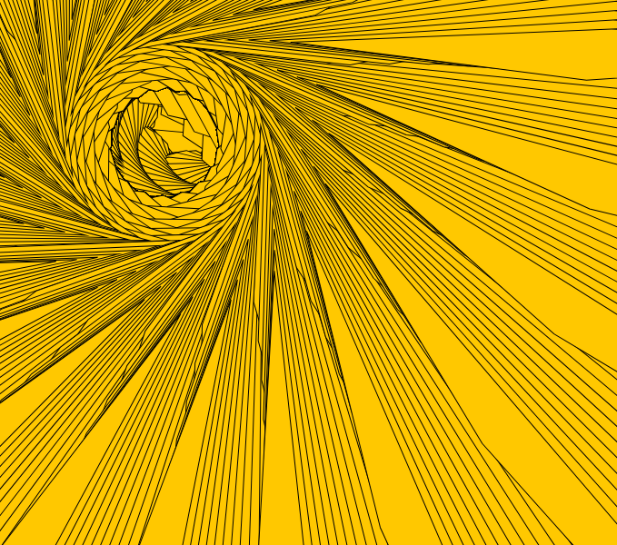
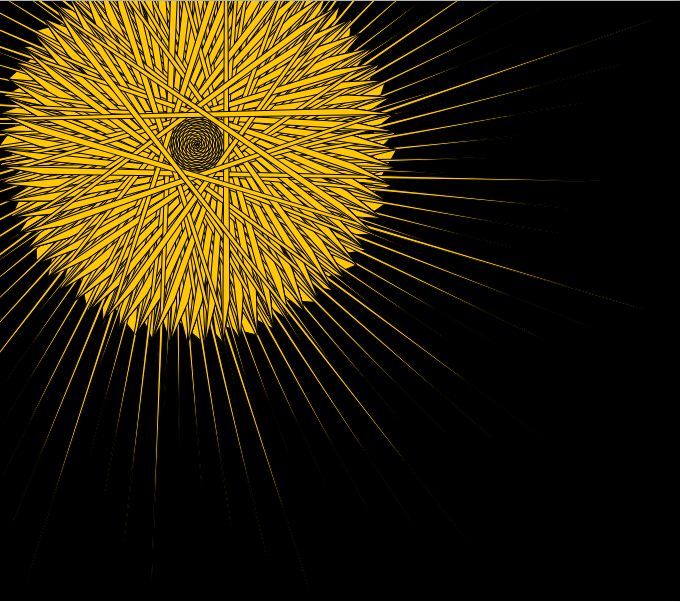

Julia Ballas 50

[Sunbursts](https://jballas.github.io/120-work/hw-8/index.html)

# Week 8 Response

date 10/17/18


## Overview

In week 8 we learned about other loops besides the `draw()`. The `for()` loop and the `while()` loop allow you to make a pattern with your code.

## Projects

- Sunbursts
- ideas/practice

## Assignment

Use a `for()` loop to create something.

## Weekly Report

This week I did got closer to actualizing an idea. I still experienced a couple of moments where the math got away from me, but I had a breakthrough at the end of my project.

In Week 6 I took a triangle rotating and added randomness and other math features to make an algorithmic art. This week I took the same basic idea, but applied it to a `for()` loop to see how the triangular rotation could be repeated.

I ended up with some interesting static designs.





### Adding `if` statements

It wasn't until I added `if` statements that I was able to animated my design how I wanted. I did a bouncing effect, like the bouncing ball from week 7's code to make the sunburst fade in and out.

```JS
//Animation, a bouncing effect
if(left_x >= 50 || left_x < 0 ) {
    speed = speed * -1;
}

left_x = left_x + speed;
```

## Problems or Issues this week


I also noticed whenever I changed my angle, I would have a completely different pattern, and I wanted a way to rotate between these patterns. I tried using a modulo, I tried using `if` statements on the angle variable. None of it was working. I spent most of my time.

Finally, I realized I needed to use a `mousePressed()` function to switch between the designs manually. This way you can discover your favorite, and watch each of them fade in and out.

Some of the angles I did not make any patterns at all, and I had no idea why. (Angle 0, angle 44.) Why do some of the patterns look so similiar.

## Specific questions/concerns for next week

As I researched my problem with the angle and the animation, I discovered that we're going to eventually make our own functions. And I realized that this might be what I wanted to do all along. So I am really looking forward to Week 10!

I'm really concerned about my final project. I have such frivolous ideas, and I'm not sure if any of them will be big enough to consider a final project.

## Other Classmates Issues/discussions


## Conclusion
